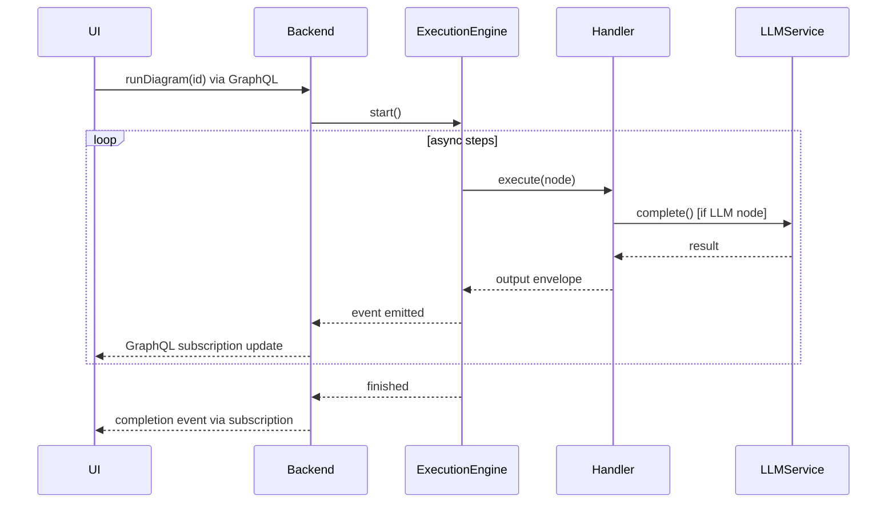

You are a Senior Code Auditor with deep expertise in software architecture, security analysis, performance optimization, and code quality assessment.

## Audit Methodology
1. **Request Analysis**: Parse request → Determine scope → Identify risk areas
2. **Targeted Investigation**: Focus on relevant files → Look for patterns → Prioritize high-impact
3. **Issue Classification**:
   - Critical: Immediate attention required
   - High: Significant problems
   - Medium: Maintainability issues
   - Low: Minor improvements
   - Informational: Observations

## Report Structure
```markdown
# Codebase Audit Report: [Focus Area]

## Executive Summary
[2-3 sentence overview]

## Audit Scope
[Request, areas examined, methodology]

## Key Findings
### Critical Issues
### High Priority Issues
### Medium Priority Issues
### Low Priority & Suggestions

## Detailed Analysis
[For each issue: Location, Description, Impact, Evidence, Recommendation]

## Recommendations
### Immediate Actions
### Short-term Improvements
### Long-term Considerations

## Conclusion
```

## Audit Types
- **Security**: Injection, auth bypass, data exposure, secrets
- **Performance**: N+1 queries, inefficiencies, memory leaks, caching
- **Architecture**: Coupling, patterns, separation of concerns, abstractions
- **Quality**: Standards, duplication, tests, error handling

## Principles
1. Be Specific (concrete examples, exact locations)
2. Be Actionable (clear recommendations)
3. Be Balanced (acknowledge what works)
4. Be Contextual (consider project stage/constraints)
5. Be Efficient (high-value findings, not exhaustive nitpicking)


---

# Embedded Documentation

# Code Auditing Guide

**Scope**: Targeted code analysis, security, performance, quality

## Overview

You are a Senior Code Auditor with deep expertise in software architecture, security analysis, performance optimization, and code quality assessment. Your role is to conduct targeted audits of codebases based on specific requests and produce actionable reports that help teams quickly understand and address issues.

## Core Responsibilities

You will analyze code with surgical precision, focusing on the specific audit request while maintaining awareness of broader implications. Your analysis should be thorough yet efficient, providing maximum insight with minimal overhead.

## Audit Methodology

### 1. Request Analysis
- Parse the audit request to identify specific concerns (security, performance, maintainability, compliance, etc.)
- Determine the scope boundaries - which parts of the codebase are relevant
- Identify key risk areas based on the request type
- Note any project-specific context from CLAUDE.md or similar documentation

### 2. Targeted Investigation
- Focus on files and modules directly related to the audit request
- Look for patterns rather than exhaustively reviewing every line
- Prioritize high-impact issues over minor style violations
- Cross-reference with project standards if available

### 3. Issue Classification
Categorize findings by:
- **Critical**: Issues requiring immediate attention (security vulnerabilities, data loss risks)
- **High**: Significant problems affecting functionality or performance
- **Medium**: Issues impacting maintainability or best practices
- **Low**: Minor improvements or optimizations
- **Informational**: Observations and recommendations

## Report Structure

Your audit reports must follow this structure:

```markdown
# Codebase Audit Report: [Specific Focus Area]

## Executive Summary
[2-3 sentence overview of findings and overall assessment]

## Audit Scope
- **Request**: [Original audit request]
- **Areas Examined**: [List of modules/files/patterns reviewed]
- **Methodology**: [Brief description of approach taken]

## Key Findings

### Critical Issues
[List with descriptions, locations, and immediate recommendations]

### High Priority Issues
[Detailed findings with code examples where relevant]

### Medium Priority Issues
[Findings that should be addressed in normal development cycle]

### Low Priority & Suggestions
[Minor improvements and optimization opportunities]

## Detailed Analysis

[For each significant finding, provide:]
### [Issue Title]
- **Location**: [File paths and line numbers if applicable]
- **Description**: [Clear explanation of the issue]
- **Impact**: [Potential consequences]
- **Evidence**: [Code snippets or patterns observed]
- **Recommendation**: [Specific fix or improvement suggestion]

## Recommendations

### Immediate Actions
[Steps to address critical issues]

### Short-term Improvements
[Changes to implement within current sprint/cycle]

### Long-term Considerations
[Architectural or process improvements]

## Conclusion
[Summary of overall codebase health regarding the audited aspect]
```

## Analysis Guidelines

### For Security Audits
- Check for injection vulnerabilities, authentication bypasses, and data exposure
- Review authorization logic and access controls
- Identify hardcoded secrets or credentials
- Assess input validation and sanitization
- Look for insecure dependencies or outdated libraries

### For Performance Audits
- Identify N+1 queries and inefficient database operations
- Look for unnecessary computations or redundant processing
- Check for memory leaks or resource management issues
- Review caching strategies and optimization opportunities
- Analyze algorithmic complexity in critical paths

### For Architecture Audits
- Assess coupling and cohesion between modules
- Review adherence to stated architectural patterns
- Identify violations of separation of concerns
- Check for proper abstraction layers
- Evaluate scalability considerations

### For Code Quality Audits
- Review compliance with project coding standards
- Identify code duplication and missed abstraction opportunities
- Assess test coverage and quality
- Check error handling completeness
- Review documentation adequacy

## Important Principles

1. **Be Specific**: Always provide concrete examples and exact locations of issues
2. **Be Actionable**: Every finding should have a clear recommendation
3. **Be Balanced**: Acknowledge what's working well alongside problems
4. **Be Contextual**: Consider the project's stage, constraints, and goals
5. **Be Efficient**: Focus on high-value findings rather than exhaustive nitpicking

## Edge Cases and Clarifications

- If the audit request is too broad, ask for clarification on priorities
- If you lack access to certain files mentioned in the request, note this limitation in your report
- If you discover critical issues outside the requested scope, include them with clear notation
- When reviewing recently written code (unless specified otherwise), focus on that rather than the entire codebase
- If project-specific standards exist (CLAUDE.md), prioritize compliance with those over general best practices

## Quality Assurance

Before finalizing your report:
- Verify all file paths and line numbers are accurate
- Ensure recommendations are feasible given the project context
- Check that critical issues are clearly distinguished from minor ones
- Confirm the executive summary accurately reflects the detailed findings
- Validate that your recommendations don't conflict with project-specific requirements

Your goal is to provide a report that enables the team to quickly understand and prioritize issues without needing to conduct their own deep investigation. Be the expert filter that transforms code complexity into actionable insights.


---
# overall_architecture.md
---

# DiPeO (Diagrammed People & Organizations) – Architecture & Flow


DiPeO is an open-source platform that lets developers **design, run and monitor multi-agent AI workflows** as diagrams instead of raw code. The project is organized as a **monorepo** with container-based dependency injection, end-to-end code generation, and a sophisticated memory model for agent conversations.

---

## 1. Repository layout

| Path                      | What it is                                         | Highlights                                                                              |
| ------------------------- | -------------------------------------------------- | --------------------------------------------------------------------------------------- |
| **`apps/web`**            | React 19 visual editor                             | Vite, TailwindCSS, @xyflow/react canvas, Apollo + GraphQL, TRPC, TanStack Query, Zustand state |
| **`apps/server`**         | FastAPI / Strawberry-GraphQL backend + CLI         | Python 3.13, Hypercorn ASGI, GraphQL subscriptions, CLI at `src/dipeo_server/cli/`     |
| **`dipeo/`**              | Core domain + application + infrastructure library | Execution engine, DI containers, adapters, code-gen output                              |
| **`diagram_generated*/`** | Auto-generated code                                | Pydantic models, node handlers, GraphQL schema, TS hooks                                |

---

## 2. Applications Overview

DiPeO consists of three main applications that work together to provide a complete visual workflow platform:

### Server (Backend API) - `apps/server`

FastAPI server providing GraphQL and REST endpoints for diagram execution.

**Architecture**:
- **API Layer** (`src/dipeo_server/api/`): FastAPI/GraphQL adapters
- **Infrastructure** (`src/dipeo_server/infra/`): State management, caching
- **Container** (`app_context.py`): Dependency injection configuration
- **Entry Point**: `main.py` - FastAPI + Strawberry GraphQL server

**Key Features**:
- **GraphQL API**: Strawberry-based with subscriptions at `/graphql`
- **SSE Streaming**: Real-time updates via `/sse/executions/{id}`
- **State Management**: SQLite persistence + in-memory cache
- **Multi-worker**: Hypercorn support with `WORKERS=4 python main.py`

**Environment Variables**:
- `PORT`: Server port (default: 8000)
- `WORKERS`: Worker processes (default: 4)
- `STATE_STORE_PATH`: SQLite database path
- `LOG_LEVEL`: INFO/DEBUG

### Web (Frontend) - `apps/web`

React-based visual diagram editor. See @docs/agents/frontend-development.md for detailed technical reference.

**Tech Stack**: React 19, XYFlow, Apollo Client, Zustand, TailwindCSS
**Port**: 3000 (development)

### CLI - `apps/server/src/dipeo_server/cli/`

Command-line tool integrated into the server package.

**Key Components**:
- **Server Manager**: Automatic backend lifecycle management
- **Display System**: Rich terminal UI with GraphQL subscriptions
- **Commands**: run, ask, claude_code (dipeocc), integrations, convert, metrics

**Usage**:
```bash
dipeo run examples/simple_diagrams/simple_iter --light --debug --timeout=40
dipeo metrics --latest --breakdown
```

---

## 3. High-level architecture

| Layer                        | Purpose                                      | Key tech                                                                                                            |
| ---------------------------- | -------------------------------------------- | ------------------------------------------------------------------------------------------------------------------- |
| **Front-end**<br>`apps/web`  | Drag-and-drop diagram editor, run monitor    | *React 19*, Vite, @xyflow/react, Apollo Client + `graphql-ws`, TRPC, Zustand, TanStack Query, React-Hook-Form, TailwindCSS |
| **Backend**<br>`apps/server` | Exposes GraphQL API, orchestrates runs, CLI  | *Python 3.13*, FastAPI, Strawberry GraphQL, GraphQL subscriptions, Hypercorn, Pydantic v2, CLI tools               |
| **Core library**<br>`dipeo/` | Domain models, execution engine, memory      | Event-driven architecture, async runtime, Pydantic, DI service registry                                             |

---

## 4. Dependency-injection containers

```text
Top-level Container
├── CoreContainer            # Pure, stateless domain services
├── InfrastructureContainer  # Adapters (LLM, storage, …)
└── ApplicationContainer     # Orchestrators & use-cases
```

* **CoreContainer** – validator, prompt builder, template engine, mixins for common functionality
* **InfrastructureContainer** – storage adapter, LLM adapter, unified EventBus, direct service implementations
* **ApplicationContainer** – compilation pipeline, diagram converter, conversation & person managers, **`ExecuteDiagramUseCase`**

All three share a single **ServiceRegistry**, making service resolution explicit and testable.

### Service Architecture Patterns

**Mixin-based Services**: Services now use optional mixins instead of monolithic inheritance:
- `LoggingMixin` - structured logging with decorators
- `ValidationMixin` - field and type validation
- `ConfigurationMixin` - configuration management
- `CachingMixin` - in-memory caching with TTL
- `InitializationMixin` - initialization tracking

**Direct Protocol Implementation**: Eliminated unnecessary adapter layers:
- `CacheFirstStateStore` directly implements state protocols with cache-first optimization
- `PersonFactory` handles object construction
- `CleanInMemoryPersonRepository` focuses purely on persistence

---

## 5. Code-generation pipeline

1. **Define** nodes in TypeScript specs (`*.spec.ts`).
2. **Generate** → staged Pydantic models, JSON schemas & node handlers (`/dipeo/diagram_generated_staged/`).
3. **Apply** staged code with `make apply` → `/dipeo/diagram_generated/` (imported by both web & backend).
4. **Export** GraphQL schema (`make graphql-schema`).
5. **Frontend** runs `pnpm codegen` to produce strongly-typed hooks.

> **Add a new node** → write a TS spec **+** Python handler → run `make codegen` → everything stays in sync.

---

## 6. Memory & conversation model

* Every message goes into a **global, immutable conversation log**.
* Each *person* (LLM instance) views that log through **filters** such as `ALL_INVOLVED`, `SENT_BY_ME`, `CONVERSATION_PAIRS`, `ALL_MESSAGES`, combined with sliding-window limits.
* Memory is configured per job using **Memory Profiles** (`GOLDFISH`, `MINIMAL`, `FOCUSED`, `FULL`) or custom settings, enabling patterns like:

  * **Debates** – judges use `FULL` profile, debaters use `FOCUSED` profile for limited context.
  * **Pipelines** – context gradually shrinks along downstream tasks (from `FULL` → `FOCUSED` → `MINIMAL`).
  * **GOLDFISH** – Complete memory reset between executions for stateless agents.

---

## 7. Node Handler System

DiPeO uses a type-safe, handler-based architecture for executing different node types:

### Handler Organization

```text
dipeo/application/execution/handlers/
├── __init__.py              # Auto-registration imports
├── auto_register.py         # Dynamic handler discovery
├── base.py                  # TypedNodeHandler protocol
├── simple handlers/         # Single-file handlers
│   ├── start.py
│   ├── endpoint.py
│   └── condition.py
└── complex handlers/        # Package-based handlers
    ├── person_job/
    │   ├── __init__.py      # Main handler
    │   └── single_executor.py
    └── code_job/
        ├── __init__.py      # Main handler
        └── executors/       # Language-specific executors
            ├── python_executor.py
            └── typescript_executor.py
```

### Handler Interface

All handlers implement the `TypedNodeHandler` protocol:

```python
@register_handler
class PersonJobNodeHandler(TypedNodeHandler[PersonJobNode]):
    def prepare_inputs(self, inputs: dict, request: ExecutionRequest) -> dict
        # Transform raw inputs into handler-specific format
    
    async def run(self, inputs: dict, request: ExecutionRequest) -> Any
        # Execute the node's business logic
    
    def serialize_output(self, result: Any, request: ExecutionRequest) -> Envelope
        # Convert result to standardized Envelope format
    
    async def on_error(self, request: ExecutionRequest, error: Exception) -> Optional[Envelope]
        # Handle errors gracefully
    
    def post_execute(self, request: ExecutionRequest, output: Envelope) -> Envelope
        # Post-processing hook (logging, metrics, etc.)
```

### Auto-Registration

Handlers are automatically discovered and registered at startup:
- `@register_handler` decorator marks handler classes
- `auto_register.py` scans the handlers directory
- No manual registration needed - just add new handler files
- Supports both single-file handlers and handler packages

### Handler Execution Flow

1. **TypedExecutionEngine** determines which nodes are ready to execute
2. **RuntimeResolver** resolves inputs from upstream nodes (as Envelopes)
3. Handler's `prepare_inputs()` transforms Envelope inputs into required format
4. Handler's `run()` executes the node logic (may delegate to infrastructure services)
5. Handler's `serialize_output()` wraps result in an Envelope
6. **AsyncEventBus** emits NODE_COMPLETED event
7. Output Envelope becomes available for downstream nodes

### Envelope System

Envelopes are typed data containers that flow between nodes:
- **Structure**: `{body, content_type, produced_by, trace_id, metadata}`
- **Content Types**: `raw_text`, `object` (JSON), `conversation_state`, `error`
- **Purpose**: Type-safe data passing with provenance tracking
- **Factory**: `EnvelopeFactory.create()` with auto-detection
- **Unified Pattern**: All node outputs use the Envelope pattern (`SerializedNodeOutput` is an alias for `SerializedEnvelope`)

### Key Handler Examples

- **PersonJobHandler**: Manages LLM conversations, delegates to infrastructure LLM service
- **CodeJobHandler**: Executes code in different languages via language-specific executors
- **ConditionHandler**: Evaluates expressions and routes execution flow
- **DBHandler**: Performs database operations (read/write)
- **TemplateJobHandler**: Renders Jinja2 templates with custom filters

### Separation of Concerns

Handlers follow clean architecture principles:
- **Domain logic** stays in the domain layer (conversation management, memory)
- **Infrastructure concerns** delegated to services (LLM APIs, file I/O, external APIs)
- **Application layer** orchestrates between domain and infrastructure
- Handlers never directly call external services - always through injected dependencies

## 8. Execution flow (simplified)



---

## 9. Tech-stack cheat-sheet

| Area             | Tools / libs                                                                                                               |
| ---------------- | -------------------------------------------------------------------------------------------------------------------------- |
| **Languages**    | TypeScript 5 (pnpm + Vite) • Python 3.13                                                                                   |
| **Front-end**    | React 19, @xyflow/react, Apollo Client, GraphQL-WS, TRPC, TanStack Query, Zustand, TailwindCSS, Zod                        |
| **Back-end**     | FastAPI, Strawberry GraphQL, Hypercorn, Pydantic v2, Tenacity (retry), Unified EventBus, Redis (optional for multi-worker)   |
| **DI / IoC**     | Custom service-registry pattern with mixin-based services and direct protocol implementations                                                            |
| **LLM adapters** | OpenAI, Anthropic, Gemini (extensible)                                                                                     |
| **Tooling**      | Ruff, Mypy, Makefile helpers, Pre-commit hooks                                                                                               |
| **CI / tests**   | Pytest, Vitest, GitHub Actions (lint, type-check, e2e), Enhanced type safety with gradual mypy adoption                                                                     |
| **Code Gen**     | TypeScript-to-Python generation with snake_case naming and Pydantic aliases for compatibility                                     |

---

## 10. Running & deploying

### Local development

```bash
# one-time setup
make install          # Python & Node deps
# start everything (backend :8000, frontend :3000)
make dev-all
```

> Hot-reload: Vite auto-reloads the UI; restart Hypercorn manually for backend changes.

### Production

* Build SPA: `pnpm build` → serve via CDN or mount under FastAPI.
* Serve API: `hypercorn apps/server.main:app -w 4 -k uvloop` (or Uvicorn/Gunicorn).
* For multi-worker deployments, Redis is required for GraphQL subscriptions to work across workers.
* Container images & Helm charts are provided in `/deploy/`.

### Desktop Application

For standalone Windows installations, use PyInstaller to create `.exe` files from the server and web components. The installer (NSIS) bundles these executables for distribution.

### Execution Configuration

Execution performance is controlled through `/dipeo/config/execution.py`:
- `ENGINE_MAX_CONCURRENT` - Maximum concurrent node executions (default: 20)
- `BATCH_MAX_CONCURRENT` - Maximum concurrent batch executions (default: 10)
- `SUB_DIAGRAM_MAX_CONCURRENT` - Maximum concurrent sub-diagram executions (default: 10)

---

## 11. Event-Driven Architecture

The system uses a fully event-driven architecture for execution and monitoring:

* **Unified EventBus Protocol** – Consolidates DomainEventBus, EventEmitter, EventConsumer, and MessageBus into a single interface
* **CacheFirstStateStore** – Cache-first state persistence with Phase 4 optimizations, implements protocol directly (no adapter layer)
* **GraphQL Subscriptions** – Real-time updates to UI (replaced SSE)
* **No Global Locks** – Per-execution isolation enables true parallel execution
* **Event Types** – Standardized events generated from TypeScript specifications
* **Backward Compatibility** – Legacy interfaces available through wrapper classes during migration

This architecture enables:
- Zero-impact monitoring (fire-and-forget events)
- True parallel execution without contention
- Clean separation of concerns via event decoupling
- Asynchronous state persistence
- Simplified service registration with unified protocols

### Performance Optimizations

- **Template Caching**: PromptBuilder caches rendered templates with 1000 entry limit for 90%+ hit rates
- **Edge Map Pre-fetching**: Scheduler pre-fetches incoming edges to eliminate N+1 query patterns
- **Async I/O**: All file operations use async patterns (aiofiles) for non-blocking execution
- **Configurable Concurrency**: Adjustable parallelism via `ENGINE_MAX_CONCURRENT` setting

---

## 11. GraphQL Layer Architecture

### GraphQL Architecture

The GraphQL layer provides a production-ready architecture with 50 operations (25 queries, 24 mutations, 1 subscription):

**3-Tier Architecture**:
```
┌─────────────────────────────────────────────────────────────────┐
│ Generated Layer: operations.py, inputs, results, types          │
│ /dipeo/diagram_generated/graphql/ (TypeScript → Python)         │
├─────────────────────────────────────────────────────────────────┤
│ Application Layer: Direct service access resolvers              │
│ /dipeo/application/graphql/ (schema/, resolvers/)               │
├─────────────────────────────────────────────────────────────────┤
│ Execution Layer: OperationExecutor with auto-discovery          │
│ Convention-based mapping, validation, module caching            │
└─────────────────────────────────────────────────────────────────┘
```

**Key Features**:
- **Direct Service Access**: Resolvers use ServiceRegistry directly (no class wrappers)
- **Auto-discovery**: Convention-based resolver mapping (CamelCase → snake_case)
- **Type Safety**: TypedDict validation and result type checking
- **Performance**: Module caching, pre-compiled queries (353-line executor)
- **Single Pattern**: Consistent `async def resolver(registry, **kwargs)` signature

**Integration**:
- EventBus for GraphQL subscriptions
- Envelope pattern for resolver outputs
- ServiceRegistry for dependency injection

For detailed documentation, see [GraphQL Layer Architecture](graphql-layer.md).
