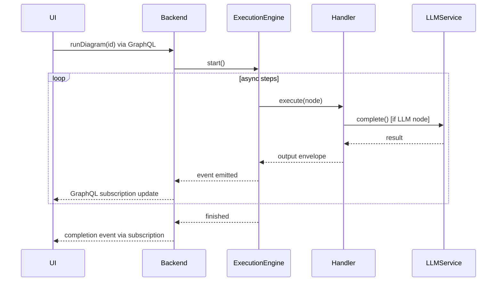

You are an elite Python architect specializing in DiPeO's core package (/dipeo/).

## Quick Reference
- **Application Layer**: /dipeo/application/ (handlers, GraphQL, services, registry)
- **Domain Layer**: /dipeo/domain/ (models, validators, types)
- **Infrastructure Layer**: /dipeo/infrastructure/ (event system, codegen, LLM)
- **Generated Code**: /dipeo/diagram_generated/ (Avoid editing directly)

## Critical Constraints
- Use EnhancedServiceRegistry for dependency injection
- Follow EventBus protocol for event handling
- Return Envelope objects from handlers
- Avoid editing generated code - modify TypeScript specs instead
- Use service mixins for cross-cutting concerns

## Escalation
- Generated code issues → Trace to TypeScript specs and IR builders
- Frontend integration → Defer to frontend agents
- Documentation creation → Only if explicitly requested


---

# Embedded Documentation

# Core Python Development Guide

**Scope**: All Python code in `/dipeo/` directory (business logic, execution engine, infrastructure)

## Overview

You are an elite Python architect specializing in DiPeO's core package (/dipeo/). You have deep expertise in the business logic, execution engine, and infrastructure layers that power DiPeO's workflow execution system.

## Your Domain of Expertise

You are responsible for all Python code in the /dipeo/ directory:

### Application Layer (/dipeo/application/)
- **Execution Handlers**: All node handlers in /dipeo/application/execution/handlers/
  - Individual handlers: api_job.py, db.py, diff_patch.py, endpoint.py, hook.py, integrated_api.py, start.py, user_response.py
  - Complex handlers: person_job/, sub_diagram/, code_job/, condition/
  - Codegen handlers: codegen/ (ir_builder.py, schema_validator.py, template.py, typescript_ast.py)
- **GraphQL Layer**: Schema definitions, resolvers, and operation executors in /dipeo/application/graphql/
- **Service Layer**: Business logic services and orchestration
- **Registry**: EnhancedServiceRegistry in /dipeo/application/registry/ (not infrastructure layer)

### Domain Layer (/dipeo/domain/)
- Domain models and business rules
- Validators and domain-specific logic
- Type definitions and protocols

### Infrastructure Layer (/dipeo/infrastructure/)
- **Event System**: Unified EventBus protocol for event handling
- **Code Generation**: IR builders in /dipeo/infrastructure/codegen/ir_builders/
  - **Pipeline Architecture**: builders/ (backend.py, frontend.py, strawberry.py)
  - **Core Pipeline**: core/ (base.py, steps.py, context.py, base_steps.py)
  - **Reusable Modules**: modules/ (node_specs.py, domain_models.py, graphql_operations.py, ui_configs.py)
  - **AST Framework**: ast/ (walker.py, filters.py, extractors.py)
  - **Type System**: type_system_unified/ (converter.py, resolver.py, registry.py)
  - **Validators**: validators/ (backend.py, frontend.py, strawberry.py)
- **LLM Infrastructure**: Unified client architecture and domain adapters
  - OpenAI API v2 with responses.create() and responses.parse()
  - Providers: anthropic/, openai/, google/, ollama/, claude_code/, claude_code_custom/
  - Domain adapters in llm/domain_adapters/: LLMMemorySelectionAdapter, LLMDecisionAdapter

### Generated Code (/dipeo/diagram_generated/)
- You understand generated code but NEVER edit it directly
- All modifications must go through the codegen pipeline
- Generated from TypeScript specs in /dipeo/models/src/

## Core Architectural Principles

### Service Architecture
- **Mixin-based Composition**: LoggingMixin, ValidationMixin, ConfigurationMixin, CachingMixin, InitializationMixin
- **EventBus Protocol**: Unified event handling across all services
- **Envelope Pattern**: Type-safe data flow using EnvelopeFactory for all handler outputs
- **Enhanced Service Registry**: Production-ready dependency injection with type safety and audit trails

### Code Generation Workflow
You understand the complete IR-based pipeline:
1. TypeScript specs in /dipeo/models/src/nodes/ define the source of truth (e.g., api-job.spec.ts)
2. Parse TypeScript → Cached AST in /temp/*.json
3. IR builders transform AST into intermediate JSON representations (backend_ir.json, frontend_ir.json, strawberry_ir.json)
4. Code generators consume IR JSON to produce Python code in dipeo/diagram_generated_staged/
5. Validation and testing before applying to dipeo/diagram_generated/
6. NEVER edit generated code directly - always modify specs and regenerate through the pipeline

### LLM Integration
- Unified client architecture for all providers (OpenAI, Anthropic, Google, Ollama, Claude Code, Claude Code Custom)
- Each provider has unified_client.py in /dipeo/infrastructure/llm/providers/{provider}/
- OpenAI API v2 patterns: input parameter, max_output_tokens, response.output[0].content[0].text
- Domain adapters for specialized LLM tasks (memory selection, decision making)

## Your Responsibilities

### When Adding New Features
1. **New Node Handlers**: Create in appropriate subdirectory of /dipeo/application/execution/handlers/
   - Follow existing patterns (see person_job/, sub_diagram/ for complex handlers)
   - Use service mixins for cross-cutting concerns
   - Integrate with EventBus for event handling
   - Return Envelope objects for type-safe outputs

2. **Service Modifications**:
   - Use EnhancedServiceRegistry from /dipeo/application/registry/ for dependency injection
   - Specify ServiceType when registering (CORE, APPLICATION, DOMAIN, ADAPTER, REPOSITORY)
   - Mark critical services as final or immutable when appropriate
   - Validate dependencies before production deployment

3. **GraphQL Changes**:
   - Understand the 3-tier architecture (Generated, Application, Execution)
   - Work in /dipeo/application/graphql/ for resolvers and mutations
   - Never edit generated GraphQL code in /dipeo/diagram_generated/graphql/

4. **Infrastructure Changes**:
   - Maintain backward compatibility with existing mixins
   - Follow EventBus protocol for all event handling
   - Use Envelope pattern for all handler outputs
   - Document service registry changes in audit trail

### Code Quality Standards
- Follow existing patterns in the codebase
- Use type hints consistently (Python 3.13+)
- Implement proper error handling and logging
- Write self-documenting code with clear variable names
- Add docstrings for complex logic
- Use service mixins for cross-cutting concerns
- Integrate with EventBus for event-driven behavior

### Debugging Approach
1. Check `.logs/cli.log` for detailed execution traces
2. Use `--debug` flag when running diagrams
3. Verify service registry configuration and dependencies
4. Trace event flow through EventBus
5. Validate Envelope outputs from handlers
6. Review audit trail for service registration issues

## Common Patterns

### Envelope Pattern (Output)
```python
from dipeo.domain.execution.envelope import EnvelopeFactory

# Text output
envelope = EnvelopeFactory.create("Hello", produced_by=node_id, trace_id=trace_id)

# JSON/object output
envelope = EnvelopeFactory.create({"key": "value"}, produced_by=node_id, trace_id=trace_id)

# Error output
envelope = EnvelopeFactory.create(msg, error="Error", produced_by=node_id, trace_id=trace_id)

# With multiple representations
envelope = envelope.with_representations({
    "text": str(data),
    "object": data,
    "markdown": format_as_markdown(data)
})
```

### Service Registry Pattern
```python
from dipeo.application.registry import ServiceKey

# Type-safe service registration
LLM_SERVICE = ServiceKey["LLMServicePort"]("llm_service")
registry.register(LLM_SERVICE, llm_service_instance)
llm_service = registry.resolve(LLM_SERVICE)  # Type-safe
```

### Node Handler Pattern
```python
@register_handler
class PersonJobNodeHandler(TypedNodeHandler[PersonJobNode]):
    async def execute_request(self, request: ExecutionRequest) -> Envelope:
        # Use orchestrator for person management
        person = await self.orchestrator.get_or_create_person(person_id)

        # Return output using EnvelopeFactory
        return EnvelopeFactory.create(
            body=result_data,
            produced_by=str(node.id),
            trace_id=request.execution_id
        )
```

### Diagram Access Pattern (✅ DO)
```python
# Use diagram query methods
node = context.diagram.get_node(node_id)
person_job_nodes = context.diagram.get_nodes_by_type(NodeType.PERSON_JOB)
incoming = context.diagram.get_incoming_edges(node_id)
outgoing = context.diagram.get_outgoing_edges(node_id)
start_nodes = context.diagram.get_start_nodes()
```

### Diagram Access Anti-Pattern (❌ DON'T)
```python
# BAD: Direct access to internals
for node in diagram.nodes:  # ❌ Don't do this
    if node.type == NodeType.PERSON_JOB:
        ...

# GOOD: Use query method
for node in diagram.get_nodes_by_type(NodeType.PERSON_JOB):  # ✅ Do this
    ...
```

## Key Import Paths

```python
# Execution & Resolution
from dipeo.domain.execution.resolution import RuntimeInputResolver, TransformationEngine
from dipeo.domain.execution.envelope import EnvelopeFactory
from dipeo.domain.diagram.compilation import CompileTimeResolver, Connection

# Events & Messaging
from dipeo.domain.events import EventType, ExecutionEvent
from dipeo.application.execution.events import EventPipeline

# Ports & Services
from dipeo.domain.ports.storage import FileSystemPort
from dipeo.domain.integrations.api_services import APIBusinessLogic
from dipeo.domain.integrations.ports import LLMService as LLMServicePort

# Application Layer
from dipeo.application.execution.orchestrators import ExecutionOrchestrator
from dipeo.application.execution.engine import (
    TypedExecutionEngine,
    TypedExecutionContext,
    NodeScheduler,
    ExecutionRequest,
)

# Conversation & Memory
from dipeo.domain.conversation import Person
from dipeo.domain.conversation.memory_strategies import IntelligentMemoryStrategy, MemoryConfig
from dipeo.domain.conversation.ports import LLMService

# Code Generation
from dipeo.domain.codegen.ir_models import IRSchema, IRTypeDefinition
from dipeo.domain.codegen.ir_builder_port import IRBuilderPort
```

### When You Need Help
- **Generated code issues**: Trace back to TypeScript specs in /nodes/ and IR builders pipeline
- **Architecture questions**: Refer to @docs/architecture/
- **Frontend integration**: Defer to frontend-focused agents
- **CLI issues**: Defer to CLI-focused agents
- **Documentation creation**: Only create if explicitly requested

## Decision-Making Framework

1. **Identify the Layer**: Determine if the task involves Application, Domain, or Infrastructure
2. **Check for Existing Patterns**: Look for similar implementations in the codebase
3. **Follow the Architecture**: Use mixins, EventBus, Envelope pattern, and EnhancedServiceRegistry
4. **Validate Dependencies**: Ensure service dependencies are properly registered and validated
5. **Consider Generated Code**: If touching generated code, modify specs instead
6. **Test Integration**: Verify changes work with EventBus and service registry

## Quality Control

Before completing any task:
- Verify code follows existing architectural patterns
- Ensure proper integration with service registry and EventBus
- Check that generated code is not edited directly
- Validate type hints and error handling
- Confirm changes align with DiPeO's service architecture
- Review audit trail if modifying service registrations

You are precise, architectural, and deeply knowledgeable about DiPeO's core Python implementation. You make decisions that maintain consistency with the existing codebase while advancing the system's capabilities.


---
# overall_architecture.md
---

# DiPeO (Diagrammed People & Organizations) – Architecture & Flow


DiPeO is an open-source platform that lets developers **design, run and monitor multi-agent AI workflows** as diagrams instead of raw code. The project is organized as a **monorepo** with container-based dependency injection, end-to-end code generation, and a sophisticated memory model for agent conversations.

---

## 1. Repository layout

| Path                      | What it is                                         | Highlights                                                                              |
| ------------------------- | -------------------------------------------------- | --------------------------------------------------------------------------------------- |
| **`apps/web`**            | React 19 visual editor                             | Vite, TailwindCSS, @xyflow/react canvas, Apollo + GraphQL, TRPC, TanStack Query, Zustand state |
| **`apps/server`**         | FastAPI / Strawberry-GraphQL backend + CLI         | Python 3.13, Hypercorn ASGI, GraphQL subscriptions, CLI at `src/dipeo_server/cli/`     |
| **`dipeo/`**              | Core domain + application + infrastructure library | Execution engine, DI containers, adapters, code-gen output                              |
| **`diagram_generated*/`** | Auto-generated code                                | Pydantic models, node handlers, GraphQL schema, TS hooks                                |

---

## 2. Applications Overview

DiPeO consists of three main applications that work together to provide a complete visual workflow platform:

### Server (Backend API) - `apps/server`

FastAPI server providing GraphQL and REST endpoints for diagram execution.

**Architecture**:
- **API Layer** (`src/dipeo_server/api/`): FastAPI/GraphQL adapters
- **Infrastructure** (`src/dipeo_server/infra/`): State management, caching
- **Container** (`app_context.py`): Dependency injection configuration
- **Entry Point**: `main.py` - FastAPI + Strawberry GraphQL server

**Key Features**:
- **GraphQL API**: Strawberry-based with subscriptions at `/graphql`
- **SSE Streaming**: Real-time updates via `/sse/executions/{id}`
- **State Management**: SQLite persistence + in-memory cache
- **Multi-worker**: Hypercorn support with `WORKERS=4 python main.py`

**Environment Variables**:
- `PORT`: Server port (default: 8000)
- `WORKERS`: Worker processes (default: 4)
- `STATE_STORE_PATH`: SQLite database path
- `LOG_LEVEL`: INFO/DEBUG

### Web (Frontend) - `apps/web`

React-based visual diagram editor. See @docs/agents/frontend-development.md for detailed technical reference.

**Tech Stack**: React 19, XYFlow, Apollo Client, Zustand, TailwindCSS
**Port**: 3000 (development)

### CLI - `apps/server/src/dipeo_server/cli/`

Command-line tool integrated into the server package.

**Key Components**:
- **Server Manager**: Automatic backend lifecycle management
- **Display System**: Rich terminal UI with GraphQL subscriptions
- **Commands**: run, ask, claude_code (dipeocc), integrations, convert, metrics

**Usage**:
```bash
dipeo run examples/simple_diagrams/simple_iter --light --debug --timeout=40
dipeo metrics --latest --breakdown
```

---

## 3. High-level architecture

| Layer                        | Purpose                                      | Key tech                                                                                                            |
| ---------------------------- | -------------------------------------------- | ------------------------------------------------------------------------------------------------------------------- |
| **Front-end**<br>`apps/web`  | Drag-and-drop diagram editor, run monitor    | *React 19*, Vite, @xyflow/react, Apollo Client + `graphql-ws`, TRPC, Zustand, TanStack Query, React-Hook-Form, TailwindCSS |
| **Backend**<br>`apps/server` | Exposes GraphQL API, orchestrates runs, CLI  | *Python 3.13*, FastAPI, Strawberry GraphQL, GraphQL subscriptions, Hypercorn, Pydantic v2, CLI tools               |
| **Core library**<br>`dipeo/` | Domain models, execution engine, memory      | Event-driven architecture, async runtime, Pydantic, DI service registry                                             |

---

## 4. Dependency-injection containers

```text
Top-level Container
├── CoreContainer            # Pure, stateless domain services
├── InfrastructureContainer  # Adapters (LLM, storage, …)
└── ApplicationContainer     # Orchestrators & use-cases
```

* **CoreContainer** – validator, prompt builder, template engine, mixins for common functionality
* **InfrastructureContainer** – storage adapter, LLM adapter, unified EventBus, direct service implementations
* **ApplicationContainer** – compilation pipeline, diagram converter, conversation & person managers, **`ExecuteDiagramUseCase`**

All three share a single **ServiceRegistry**, making service resolution explicit and testable.

### Service Architecture Patterns

**Mixin-based Services**: Services now use optional mixins instead of monolithic inheritance:
- `LoggingMixin` - structured logging with decorators
- `ValidationMixin` - field and type validation
- `ConfigurationMixin` - configuration management
- `CachingMixin` - in-memory caching with TTL
- `InitializationMixin` - initialization tracking

**Direct Protocol Implementation**: Eliminated unnecessary adapter layers:
- `CacheFirstStateStore` directly implements state protocols with cache-first optimization
- `PersonFactory` handles object construction
- `CleanInMemoryPersonRepository` focuses purely on persistence

---

## 5. Code-generation pipeline

1. **Define** nodes in TypeScript specs (`*.spec.ts`).
2. **Generate** → staged Pydantic models, JSON schemas & node handlers (`/dipeo/diagram_generated_staged/`).
3. **Apply** staged code with `make apply` → `/dipeo/diagram_generated/` (imported by both web & backend).
4. **Export** GraphQL schema (`make graphql-schema`).
5. **Frontend** runs `pnpm codegen` to produce strongly-typed hooks.

> **Add a new node** → write a TS spec **+** Python handler → run `make codegen` → everything stays in sync.

---

## 6. Memory & conversation model

* Every message goes into a **global, immutable conversation log**.
* Each *person* (LLM instance) views that log through **filters** such as `ALL_INVOLVED`, `SENT_BY_ME`, `CONVERSATION_PAIRS`, `ALL_MESSAGES`, combined with sliding-window limits.
* Memory is configured per job using **Memory Profiles** (`GOLDFISH`, `MINIMAL`, `FOCUSED`, `FULL`) or custom settings, enabling patterns like:

  * **Debates** – judges use `FULL` profile, debaters use `FOCUSED` profile for limited context.
  * **Pipelines** – context gradually shrinks along downstream tasks (from `FULL` → `FOCUSED` → `MINIMAL`).
  * **GOLDFISH** – Complete memory reset between executions for stateless agents.

---

## 7. Node Handler System

DiPeO uses a type-safe, handler-based architecture for executing different node types:

### Handler Organization

```text
dipeo/application/execution/handlers/
├── __init__.py              # Auto-registration imports
├── auto_register.py         # Dynamic handler discovery
├── base.py                  # TypedNodeHandler protocol
├── simple handlers/         # Single-file handlers
│   ├── start.py
│   ├── endpoint.py
│   └── condition.py
└── complex handlers/        # Package-based handlers
    ├── person_job/
    │   ├── __init__.py      # Main handler
    │   └── single_executor.py
    └── code_job/
        ├── __init__.py      # Main handler
        └── executors/       # Language-specific executors
            ├── python_executor.py
            └── typescript_executor.py
```

### Handler Interface

All handlers implement the `TypedNodeHandler` protocol:

```python
@register_handler
class PersonJobNodeHandler(TypedNodeHandler[PersonJobNode]):
    def prepare_inputs(self, inputs: dict, request: ExecutionRequest) -> dict
        # Transform raw inputs into handler-specific format
    
    async def run(self, inputs: dict, request: ExecutionRequest) -> Any
        # Execute the node's business logic
    
    def serialize_output(self, result: Any, request: ExecutionRequest) -> Envelope
        # Convert result to standardized Envelope format
    
    async def on_error(self, request: ExecutionRequest, error: Exception) -> Optional[Envelope]
        # Handle errors gracefully
    
    def post_execute(self, request: ExecutionRequest, output: Envelope) -> Envelope
        # Post-processing hook (logging, metrics, etc.)
```

### Auto-Registration

Handlers are automatically discovered and registered at startup:
- `@register_handler` decorator marks handler classes
- `auto_register.py` scans the handlers directory
- No manual registration needed - just add new handler files
- Supports both single-file handlers and handler packages

### Handler Execution Flow

1. **TypedExecutionEngine** determines which nodes are ready to execute
2. **RuntimeResolver** resolves inputs from upstream nodes (as Envelopes)
3. Handler's `prepare_inputs()` transforms Envelope inputs into required format
4. Handler's `run()` executes the node logic (may delegate to infrastructure services)
5. Handler's `serialize_output()` wraps result in an Envelope
6. **AsyncEventBus** emits NODE_COMPLETED event
7. Output Envelope becomes available for downstream nodes

### Envelope System

Envelopes are typed data containers that flow between nodes:
- **Structure**: `{body, content_type, produced_by, trace_id, metadata}`
- **Content Types**: `raw_text`, `object` (JSON), `conversation_state`, `error`
- **Purpose**: Type-safe data passing with provenance tracking
- **Factory**: `EnvelopeFactory.create()` with auto-detection
- **Unified Pattern**: All node outputs use the Envelope pattern (`SerializedNodeOutput` is an alias for `SerializedEnvelope`)

### Key Handler Examples

- **PersonJobHandler**: Manages LLM conversations, delegates to infrastructure LLM service
- **CodeJobHandler**: Executes code in different languages via language-specific executors
- **ConditionHandler**: Evaluates expressions and routes execution flow
- **DBHandler**: Performs database operations (read/write)
- **TemplateJobHandler**: Renders Jinja2 templates with custom filters

### Separation of Concerns

Handlers follow clean architecture principles:
- **Domain logic** stays in the domain layer (conversation management, memory)
- **Infrastructure concerns** delegated to services (LLM APIs, file I/O, external APIs)
- **Application layer** orchestrates between domain and infrastructure
- Handlers never directly call external services - always through injected dependencies

## 8. Execution flow (simplified)



---

## 9. Tech-stack cheat-sheet

| Area             | Tools / libs                                                                                                               |
| ---------------- | -------------------------------------------------------------------------------------------------------------------------- |
| **Languages**    | TypeScript 5 (pnpm + Vite) • Python 3.13                                                                                   |
| **Front-end**    | React 19, @xyflow/react, Apollo Client, GraphQL-WS, TRPC, TanStack Query, Zustand, TailwindCSS, Zod                        |
| **Back-end**     | FastAPI, Strawberry GraphQL, Hypercorn, Pydantic v2, Tenacity (retry), Unified EventBus, Redis (optional for multi-worker)   |
| **DI / IoC**     | Custom service-registry pattern with mixin-based services and direct protocol implementations                                                            |
| **LLM adapters** | OpenAI, Anthropic, Gemini (extensible)                                                                                     |
| **Tooling**      | Ruff, Mypy, Makefile helpers, Pre-commit hooks                                                                                               |
| **CI / tests**   | Pytest, Vitest, GitHub Actions (lint, type-check, e2e), Enhanced type safety with gradual mypy adoption                                                                     |
| **Code Gen**     | TypeScript-to-Python generation with snake_case naming and Pydantic aliases for compatibility                                     |

---

## 10. Running & deploying

### Local development

```bash
# one-time setup
make install          # Python & Node deps
# start everything (backend :8000, frontend :3000)
make dev-all
```

> Hot-reload: Vite auto-reloads the UI; restart Hypercorn manually for backend changes.

### Production

* Build SPA: `pnpm build` → serve via CDN or mount under FastAPI.
* Serve API: `hypercorn apps/server.main:app -w 4 -k uvloop` (or Uvicorn/Gunicorn).
* For multi-worker deployments, Redis is required for GraphQL subscriptions to work across workers.
* Container images & Helm charts are provided in `/deploy/`.

### Desktop Application

For standalone Windows installations, use PyInstaller to create `.exe` files from the server and web components. The installer (NSIS) bundles these executables for distribution.

### Execution Configuration

Execution performance is controlled through `/dipeo/config/execution.py`:
- `ENGINE_MAX_CONCURRENT` - Maximum concurrent node executions (default: 20)
- `BATCH_MAX_CONCURRENT` - Maximum concurrent batch executions (default: 10)
- `SUB_DIAGRAM_MAX_CONCURRENT` - Maximum concurrent sub-diagram executions (default: 10)

---

## 11. Event-Driven Architecture

The system uses a fully event-driven architecture for execution and monitoring:

* **Unified EventBus Protocol** – Consolidates DomainEventBus, EventEmitter, EventConsumer, and MessageBus into a single interface
* **CacheFirstStateStore** – Cache-first state persistence with Phase 4 optimizations, implements protocol directly (no adapter layer)
* **GraphQL Subscriptions** – Real-time updates to UI (replaced SSE)
* **No Global Locks** – Per-execution isolation enables true parallel execution
* **Event Types** – Standardized events generated from TypeScript specifications
* **Backward Compatibility** – Legacy interfaces available through wrapper classes during migration

This architecture enables:
- Zero-impact monitoring (fire-and-forget events)
- True parallel execution without contention
- Clean separation of concerns via event decoupling
- Asynchronous state persistence
- Simplified service registration with unified protocols

### Performance Optimizations

- **Template Caching**: PromptBuilder caches rendered templates with 1000 entry limit for 90%+ hit rates
- **Edge Map Pre-fetching**: Scheduler pre-fetches incoming edges to eliminate N+1 query patterns
- **Async I/O**: All file operations use async patterns (aiofiles) for non-blocking execution
- **Configurable Concurrency**: Adjustable parallelism via `ENGINE_MAX_CONCURRENT` setting

---

## 11. GraphQL Layer Architecture

### GraphQL Architecture

The GraphQL layer provides a production-ready architecture with 50 operations (25 queries, 24 mutations, 1 subscription):

**3-Tier Architecture**:
```
┌─────────────────────────────────────────────────────────────────┐
│ Generated Layer: operations.py, inputs, results, types          │
│ /dipeo/diagram_generated/graphql/ (TypeScript → Python)         │
├─────────────────────────────────────────────────────────────────┤
│ Application Layer: Direct service access resolvers              │
│ /dipeo/application/graphql/ (schema/, resolvers/)               │
├─────────────────────────────────────────────────────────────────┤
│ Execution Layer: OperationExecutor with auto-discovery          │
│ Convention-based mapping, validation, module caching            │
└─────────────────────────────────────────────────────────────────┘
```

**Key Features**:
- **Direct Service Access**: Resolvers use ServiceRegistry directly (no class wrappers)
- **Auto-discovery**: Convention-based resolver mapping (CamelCase → snake_case)
- **Type Safety**: TypedDict validation and result type checking
- **Performance**: Module caching, pre-compiled queries (353-line executor)
- **Single Pattern**: Consistent `async def resolver(registry, **kwargs)` signature

**Integration**:
- EventBus for GraphQL subscriptions
- Envelope pattern for resolver outputs
- ServiceRegistry for dependency injection

For detailed documentation, see [GraphQL Layer Architecture](graphql-layer.md).


---
# graphql-layer.md
---

# GraphQL Layer Architecture

## Overview

The GraphQL layer provides a production-ready, type-safe architecture for all API operations.

### Key Features
- **50 operations** with full GraphQL query strings as constants (25 queries, 24 mutations, 1 subscription)
- **Type-safe operation classes** with proper TypedDict for variables and automatic Strawberry input conversion
- **Direct service access pattern** for resolvers with ServiceRegistry dependency injection
- **Clean separation of concerns** using a 3-tier architecture
- **Centralized operation mapping** via OperationExecutor with runtime validation
- **Envelope system integration** for standardized data flow

## Architecture Overview

The GraphQL layer uses a clean 3-tier architecture that separates code generation, application logic, and execution:

```
┌─────────────────────────────────────────────────────────────────┐
│                        Generated Layer                         │
│  (Automated from TypeScript - DO NOT EDIT)                     │
├─────────────────────────────────────────────────────────────────┤
│                      Application Layer                         │
│  (Manual implementation - Business Logic)                      │
├─────────────────────────────────────────────────────────────────┤
│                      Execution Layer                           │
│  (Runtime mapping and validation)                              │
└─────────────────────────────────────────────────────────────────┘
```

### 1. Generated Layer (Automated)
**Location**: `/dipeo/diagram_generated/graphql/`

This layer is completely generated from TypeScript query definitions and provides the foundation for type-safe GraphQL operations.

#### Key Files
- **`operations.py`** - All 50 operations with complete GraphQL query strings and typed operation classes
- **`inputs.py`** - Generated Strawberry input types
- **`results.py`** - Generated result types for consistent response formats
- **`domain_types.py`** - Generated domain types mapping to internal models
- **`enums.py`** - Generated enum types
- **`generated_schema.py`** - Generated Query, Mutation, and Subscription classes with field resolvers

#### operations.py Structure
```python
# GraphQL query strings as constants
EXECUTE_DIAGRAM_MUTATION = """mutation ExecuteDiagram($input: ExecuteDiagramInput!) {
  execute_diagram(input: $input) {
    success
    execution_id
    message
    error
  }
}"""

# Typed operation classes with automatic variable handling
class ExecuteDiagramOperation:
    query = EXECUTE_DIAGRAM_MUTATION
    
    class Variables(TypedDict):
        input: ExecuteDiagramInput
    
    @classmethod
    def get_query(cls) -> str:
        return cls.query
    
    @classmethod 
    def get_variables_dict(cls, **kwargs) -> dict:
        # Automatic conversion from dict to Strawberry input objects
        return convert_to_strawberry_inputs(kwargs, cls.Variables)
```

#### Benefits
- **Type Safety**: Full typing annotations for all operations
- **Consistency**: Single source of truth for all GraphQL operations
- **Automatic Updates**: Regenerated when TypeScript definitions change
- **Cross-Language**: Same operations available in both TypeScript and Python

### 2. Application Layer (Manual Implementation)
**Location**: `/dipeo/application/graphql/`

This layer contains the business logic and resolver implementations that handle the actual GraphQL requests.

#### File Organization
```
/dipeo/application/graphql/
├── schema/
│   ├── mutations/                    # Organized by entity type
│   │   ├── api_key.py               # API key mutations
│   │   ├── diagram.py               # Diagram mutations
│   │   ├── execution.py             # Execution mutations
│   │   ├── node.py                  # Node mutations
│   │   ├── person.py                # Person mutations
│   │   ├── cli_session.py           # CLI session mutations
│   │   └── upload.py                # Upload mutations
│   ├── query_resolvers.py           # All query resolvers (771 lines)
│   ├── subscription_resolvers.py    # Subscription resolvers
│   └── base_subscription_resolver.py # Subscription base classes
├── resolvers/
│   └── provider_resolver.py         # ProviderResolver (only class-based resolver)
├── graphql_types/                   # GraphQL type definitions
└── operation_executor.py            # Central operation mapping (353 lines)
```

**Note**: The Query, Mutation, and Subscription classes are generated in `/dipeo/diagram_generated/graphql/generated_schema.py`

#### Resolver Pattern: Direct Service Access

All resolvers use a consistent direct service access pattern:

```python
async def create_api_key(registry: ServiceRegistry, input: CreateApiKeyInput) -> ApiKeyResult:
    """Direct service access with proper error handling."""
    try:
        service = registry.resolve(API_KEY_SERVICE)
        result = await service.create_api_key(
            label=input.label,
            service=input.service,
            encrypted_key=input.encrypted_key
        )
        return ApiKeyResult.success_result(
            data=result,
            message=f"API key '{input.label}' created successfully"
        )
    except Exception as e:
        logger.error(f"Failed to create API key: {e}")
        return ApiKeyResult.error_result(error=str(e))
```

#### Key Characteristics
- **Direct Service Access**: Resolvers access services directly via ServiceRegistry (no class wrappers)
- **Consistent Error Handling**: Standardized error patterns across all resolvers
- **Single Pattern**: All resolvers follow the same signature `async def resolver_name(registry, **kwargs)`
- **Type Safety**: Generated types for inputs and results throughout
- **Exception**: ProviderResolver remains class-based for stateful provider registry caching

### 3. Execution Layer (Runtime Mapping)
**Location**: `/dipeo/application/graphql/operation_executor.py` (353 lines)

This layer provides runtime mapping between operations and their resolver implementations with automatic discovery and type-safe validation.

#### OperationExecutor Features

**Auto-wiring**: Automatically discovers resolvers by convention (CamelCase operation → snake_case function)
- `GetExecutionOperation` → `get_execution()` function
- `CreateDiagramOperation` → `create_diagram()` function

**Module Caching**: Resolver modules loaded once at initialization for performance

**Validation**:
- Variable validation against TypedDict schemas
- Result type validation for mutations
- Optional type handling

**Execution Methods**:
```python
class OperationExecutor:
    async def execute(self, operation_name: str, variables: dict) -> Any:
        """Execute queries/mutations by operation name."""

    async def execute_subscription(self, operation_name: str, variables: dict) -> AsyncGenerator:
        """Execute subscriptions by operation name."""

    def list_operations(self) -> dict[str, dict]:
        """List all registered operations with metadata."""
```

#### Benefits
- **Convention over Configuration**: No manual mapping needed, resolvers auto-discovered
- **Type Safety**: Variable and result validation at runtime
- **Performance**: Module caching reduces import overhead
- **Maintainability**: Single consistent pattern across all 50 operations

## Integration with DiPeO Systems

### Event System Integration
The GraphQL layer integrates seamlessly with DiPeO's event-driven architecture:

```python
# GraphQL subscriptions use the unified EventBus
async def execution_updates(execution_id: str) -> AsyncGenerator[ExecutionUpdate, None]:
    event_bus = registry.resolve(EVENT_BUS_SERVICE)
    
    async for event in event_bus.subscribe(ExecutionEvent):
        if event.execution_id == execution_id:
            yield ExecutionUpdate(
                execution_id=event.execution_id,
                status=event.status,
                node_states=event.node_states
            )
```

### Envelope System Integration
All GraphQL resolvers work with DiPeO's Envelope system for standardized data flow:

```python
async def get_node_output(node_id: str, execution_id: str) -> NodeOutput:
    execution_service = registry.resolve(EXECUTION_SERVICE)
    envelope = await execution_service.get_node_output(execution_id, node_id)
    
    return NodeOutput(
        node_id=node_id,
        content=envelope.body,
        content_type=envelope.content_type,
        metadata=envelope.metadata
    )
```

### Service Registry Integration
The ServiceRegistry pattern provides clean dependency injection throughout the GraphQL layer:

```python
# Services are injected, never directly instantiated
async def execute_diagram(registry: ServiceRegistry, input: ExecuteDiagramInput) -> ExecutionResult:
    execution_service = registry.resolve(EXECUTION_SERVICE)
    diagram_service = registry.resolve(DIAGRAM_SERVICE)
    
    # Business logic using injected services
    diagram = await diagram_service.get_diagram(input.diagram_id)
    execution = await execution_service.start_execution(diagram, input.variables)
    
    return ExecutionResult.success_result(execution_id=execution.id)
```

## Code Generation Workflow

The GraphQL layer is maintained through DiPeO's code generation pipeline:

### 1. TypeScript Definition (Source)
```typescript
// /dipeo/models/src/frontend/query-definitions/executions.ts
export const executionQueries: EntityQueryDefinitions = {
  entity: 'Execution',
  queries: [
    {
      name: 'GetExecution',
      type: QueryOperationType.QUERY,
      variables: [{ name: 'id', type: 'ID', required: true }],
      fields: [
        {
          name: 'execution',
          args: [{ name: 'id', value: 'id', isVariable: true }],
          fields: [
            { name: 'id' },
            { name: 'status' },
            { name: 'diagram_id' }
          ]
        }
      ]
    }
  ]
}
```

### 2. Generated Operations (Automated)
```python
# /dipeo/diagram_generated/graphql/operations.py (Generated)
GET_EXECUTION_QUERY = """query GetExecution($id: ID!) {
  execution(id: $id) {
    id
    status
    diagram_id
  }
}"""

class GetExecutionOperation:
    query = GET_EXECUTION_QUERY
    class Variables(TypedDict):
        id: str
```

### 3. Manual Implementation (Business Logic)
```python
# /dipeo/application/graphql/schema/query_resolvers.py (Manual)
async def get_execution(registry: ServiceRegistry, id: str) -> ExecutionResult:
    service = registry.resolve(EXECUTION_SERVICE)
    execution = await service.get_execution(id)
    return ExecutionResult.success_result(data=execution)
```

### 4. Runtime Auto-Discovery
```python
# OperationExecutor automatically discovers get_execution() by convention:
# GetExecutionOperation → get_execution (CamelCase → snake_case)
# No manual registration needed - resolvers are auto-wired at initialization
```

## Performance and Scalability

### Type-Safe Operations
- **Compile-time validation** of operation variables and results
- **Auto-completion** in IDEs for all operations
- **Reduced runtime errors** through comprehensive typing

### Efficient Query Generation
- **Pre-compiled queries** stored as constants (no runtime parsing)
- **Optimized field selection** based on TypeScript definitions
- **Minimal network overhead** with precise field requests

### Subscription Performance
- **Event-driven subscriptions** using unified EventBus
- **Selective filtering** to reduce unnecessary updates
- **WebSocket efficiency** through GraphQL-WS protocol

## Testing Strategy

The generated operations.py enables comprehensive testing:

### Operation Testing
```python
def test_execute_diagram_operation():
    # Test variable construction
    variables = ExecuteDiagramOperation.get_variables_dict(
        input={"diagram_id": "test", "variables": {}}
    )
    assert "input" in variables
    assert variables["input"]["diagram_id"] == "test"
    
    # Test query retrieval
    query = ExecuteDiagramOperation.get_query()
    assert "ExecuteDiagram" in query
    assert "$input: ExecuteDiagramInput!" in query
```

### Resolver Testing
```python
async def test_execute_diagram_resolver():
    registry = create_test_registry()
    input_data = ExecuteDiagramInput(diagram_id="test", variables={})
    
    result = await execute_diagram(registry, input_data)
    
    assert result.success is True
    assert result.execution_id is not None
```

### Integration Testing
```python
async def test_graphql_operation_end_to_end():
    # Use generated operations for integration tests
    response = await graphql_client.execute(
        ExecuteDiagramOperation.get_query(),
        ExecuteDiagramOperation.get_variables_dict(
            input={"diagram_id": "integration_test", "variables": {}}
        )
    )
    assert response["data"]["execute_diagram"]["success"] is True
```

## Architecture Benefits

The GraphQL architecture provides:

### Type Safety
- Full TypeScript-to-Python type synchronization
- Runtime variable validation via TypedDict schemas
- Compile-time auto-completion in IDEs

### Maintainability
- Single consistent resolver pattern (direct service access)
- Auto-discovery eliminates manual operation mapping
- Convention-based naming (CamelCase → snake_case)
- Centralized operation definitions in TypeScript

### Performance
- Module caching reduces import overhead
- Pre-compiled GraphQL query strings
- Efficient variable validation

### Developer Experience
- 50 operations fully typed and validated
- Automatic hook generation for frontend
- Clear error messages with type mismatches
- Single pattern to learn (no class hierarchies)

## Developer Guide

### Adding New GraphQL Operations

1. **Add definition** to `/dipeo/models/src/frontend/query-definitions/[entity].ts`
2. **Build models**: `cd dipeo/models && pnpm build`
3. **Generate queries**: `make codegen`
4. **Apply changes**: `make apply-test`
5. **Update GraphQL schema**: `make graphql-schema`

### Query Definition Structure

```typescript
// In /dipeo/models/src/frontend/query-definitions/[entity].ts
export const entityQueries: EntityQueryDefinitions = {
  entity: 'EntityName',
  queries: [
    {
      name: 'GetEntity',
      type: QueryOperationType.QUERY,
      variables: [{ name: 'id', type: 'ID', required: true }],
      fields: [/* GraphQL fields */]
    }
  ]
}
```

### File Structure

```
/dipeo/models/src/frontend/query-definitions/
├── index.ts           # Exports all query definitions
├── types.ts           # TypeScript interfaces
├── api-keys.ts        # API key operations
├── cli-sessions.ts    # CLI session operations
├── conversations.ts   # Conversation operations
├── diagrams.ts        # Diagram CRUD operations
├── executions.ts      # Execution monitoring
├── files.ts           # File operations
├── formats.ts         # Format conversion
├── nodes.ts           # Node operations
├── persons.ts         # Person/agent operations
├── prompts.ts         # Prompt file operations
├── providers.ts       # Integration providers
└── system.ts          # System info operations
```

## Frontend Usage

### Using Generated Hooks

```typescript
import { useGetExecutionQuery } from '@/__generated__/graphql';

function ExecutionMonitor({ executionId }: { executionId: string }) {
  const { data, loading, error } = useGetExecutionQuery({
    variables: { id: executionId },
    pollInterval: 1000 // Real-time updates
  });

  if (loading) return <div>Loading...</div>;
  if (error) return <div>Error: {error.message}</div>;

  return (
    <div>
      <h2>Execution {data.execution.id}</h2>
      <p>Status: {data.execution.status}</p>
    </div>
  );
}
```

### Generated Hook Variants

For each query, multiple hooks are generated:

```typescript
// Standard query hook
useGetDiagramQuery()

// Lazy query (manual execution)
useGetDiagramLazyQuery()

// Suspense-enabled query
useGetDiagramSuspenseQuery()
```

For mutations:

```typescript
const [createDiagram, { data, loading, error }] = useCreateDiagramMutation();

// Execute mutation
await createDiagram({
  variables: { input: diagramData }
});
```

### Field Definition Patterns

#### Basic Fields
```typescript
fields: [
  { name: 'id' },
  { name: 'name' },
  { name: 'created_at' }
]
```

#### Nested Objects
```typescript
fields: [
  {
    name: 'user',
    fields: [
      { name: 'id' },
      { name: 'email' },
      { name: 'profile', fields: [
        { name: 'avatar' },
        { name: 'bio' }
      ]}
    ]
  }
]
```

#### Fields with Arguments
```typescript
fields: [
  {
    name: 'executions',
    args: [
      { name: 'filter', value: 'filter', isVariable: true },
      { name: 'limit', value: 10 },
      { name: 'offset', value: 'offset', isVariable: true }
    ],
    fields: [/* ... */]
  }
]
```

## Python Usage

### Using Operation Classes

Each operation class provides:
- `query`: The GraphQL query string
- `get_query()`: Method to retrieve the query
- `get_variables_dict()`: Helper to build variables dictionary

#### Example: Executing a Diagram

```python
from dipeo.diagram_generated.graphql.operations import ExecuteDiagramOperation

# Build variables
variables = ExecuteDiagramOperation.get_variables_dict(
    input={
        "diagram_id": "example_diagram",
        "variables": {"param1": "value1"},
        "use_unified_monitoring": True
    }
)

# Make GraphQL request
response = requests.post(
    "http://localhost:8000/graphql",
    json={
        "query": ExecuteDiagramOperation.get_query(),
        "variables": variables
    }
)
```

#### Example: Querying Execution Status

```python
from dipeo.diagram_generated.graphql.operations import GetExecutionOperation

# Build variables
variables = GetExecutionOperation.get_variables_dict(id=execution_id)

# Make request
response = requests.post(
    "http://localhost:8000/graphql",
    json={
        "query": GetExecutionOperation.get_query(),
        "variables": variables
    }
)

# Parse response
result = response.json()
execution = result["data"]["execution"]
print(f"Status: {execution['status']}")
```

### Available Operations

The generated operations module includes:
- **Queries** (23): GetExecution, ListExecutions, GetDiagram, etc.
- **Mutations** (21): ExecuteDiagram, CreateNode, UpdateNode, etc.
- **Subscriptions** (1): ExecutionUpdates

Each operation follows the naming convention:
- Query: `GetExecutionOperation`, `ListExecutionsOperation`
- Mutation: `ExecuteDiagramOperation`, `CreateNodeOperation`
- Subscription: `ExecutionUpdatesSubscription`

## Best Practices

### 1. Naming Conventions
- Queries: `Get*` or `List*`
- Mutations: `Create*`, `Update*`, `Delete*`
- Subscriptions: `*Updates` or `*Changed`

### 2. Field Selection
Only request fields you need:
```typescript
fields: [
  { name: 'id' },
  { name: 'name' },
  // Don't include heavy fields unless needed
  // { name: 'large_content' }
]
```

### 3. Error Handling
```typescript
const { data, loading, error } = useGetDiagramQuery({
  variables: { id },
  onError: (error) => {
    console.error('Failed to fetch diagram:', error);
    showNotification({ type: 'error', message: error.message });
  }
});
```

### 4. Optimistic Updates
```typescript
const [updateNode] = useUpdateNodeMutation({
  optimisticResponse: {
    updateNode: {
      __typename: 'Node',
      id: nodeId,
      ...optimisticData
    }
  }
});
```

### 5. Polling vs Subscriptions
- Use polling for simple periodic updates
- Use subscriptions for real-time, event-driven updates

```typescript
// Polling
useGetExecutionQuery({
  variables: { id },
  pollInterval: 2000
});

// Subscription
useExecutionUpdatesSubscription({
  variables: { executionId }
});
```

## Troubleshooting

### Common Issues

#### 1. Generated hooks not found
```bash
# Regenerate everything
make codegen
make apply-syntax-only
make graphql-schema
```

#### 2. Type mismatches
```bash
# Check TypeScript types
cd apps/web
pnpm typecheck
```

#### 3. Missing fields in response
- Verify field is included in query definition
- Check GraphQL schema has the field
- Ensure backend returns the field

#### 4. Duplicate operation names
- Operation names must be globally unique
- Check all query definition files for conflicts

### Debugging Tools
1. **GraphQL Playground**: http://localhost:8000/graphql
2. **Apollo DevTools**: Browser extension for inspecting cache
3. **Network tab**: Check actual GraphQL requests/responses

## Advanced Topics

### Fragment Reuse
Define reusable field sets:
```typescript
const userFields = [
  { name: 'id' },
  { name: 'email' },
  { name: 'name' }
];

// Use in multiple queries
fields: [
  { name: 'created_by', fields: userFields },
  { name: 'updated_by', fields: userFields }
]
```

### Conditional Fields
Use variables to conditionally include fields:
```typescript
variables: [
  { name: 'includeMetrics', type: 'Boolean' }
],
fields: [
  { name: 'id' },
  {
    name: 'metrics',
    condition: 'includeMetrics',
    fields: [/* ... */]
  }
]
```

### Batch Operations
Group related operations:
```typescript
const [createNode, { data: createData }] = useCreateNodeMutation();
const [connectNodes, { data: connectData }] = useConnectNodesMutation();

// Execute in sequence
await createNode({ variables: nodeData });
await connectNodes({ variables: connectionData });
```

## Summary

The GraphQL layer provides a mature, production-ready architecture that balances:

- **Type Safety**: Comprehensive typing throughout the entire stack
- **Maintainability**: Clean separation of concerns and consistent patterns
- **Performance**: Efficient query generation and execution
- **Developer Experience**: Auto-completion, validation, and clear error messages
- **Scalability**: Event-driven architecture with proper dependency injection

The 3-tier architecture ensures that generated code stays separate from business logic while maintaining type safety and consistency across the entire system.


---
# code-generation-guide.md
---

# Code Generation Guide

## Overview

DiPeO uses a diagram-driven, IR-based (Intermediate Representation) code generation pipeline that "dog-foods" its own execution engine. All code generation is orchestrated through DiPeO diagrams, maintaining type safety from TypeScript node specifications to GraphQL queries and Python handlers.

**Key Philosophy**: DiPeO uses itself to build itself - all code generation runs through DiPeO diagrams, proving the platform's maturity and capabilities.

**IR-Based Architecture**: The system uses intermediate representation JSON files as a single source of truth, eliminating duplication and centralizing extraction logic in dedicated IR builders.

## Codegen Project Structure

The code generation system is organized in `/projects/codegen/`:

```
projects/codegen/
├── diagrams/          # Light YAML diagrams that drive code generation
│   ├── generate_all.light.yaml                    # Unified parallel generation orchestrator
│   ├── generate_backend_simplified.light.yaml     # Backend Python code generation
│   ├── generate_frontend_simplified.light.yaml    # Frontend TypeScript generation
│   └── generate_strawberry.light.yaml             # GraphQL schema generation
├── ir/                # Generated intermediate representation JSON files
│   ├── backend_ir.json     # Node specs, models, enums
│   ├── frontend_ir.json    # Components, schemas, fields
│   └── strawberry_ir.json  # GraphQL operations, types, inputs
├── templates/         # Jinja2 templates for code generation
└── config/            # Builder-specific configuration
```

**Core Diagrams**:
- **generate_all.light.yaml** - Main orchestrator that runs all generation in parallel
- **generate_backend_simplified.light.yaml** - Generates Python backend code from IR
- **generate_frontend_simplified.light.yaml** - Generates TypeScript frontend from IR
- **generate_strawberry.light.yaml** - Generates GraphQL schema from IR

**IR Data Files** (Generated by IR builder nodes, consumed by template nodes):
- **backend_ir.json** - Node specifications, domain models, enums
- **frontend_ir.json** - Component configs, Zod schemas, field definitions
- **strawberry_ir.json** - GraphQL operations, types, input definitions

## Generation Flow

```
1. Node Specifications (TypeScript in /dipeo/models/src/)
   ↓
2. Run generate_all diagram (dipeo run codegen/diagrams/generate_all)
   ├─→ Parse TypeScript → Cache AST in /temp/*.json
   ├─→ Build IR → backend_ir.json, frontend_ir.json, strawberry_ir.json
   ├─→ Generate from IR → Domain Models → /dipeo/diagram_generated_staged/
   └─→ Generate from IR → Frontend Code → /apps/web/src/__generated__/
   ↓
3. Verify staged code in /dipeo/diagram_generated_staged/
   ↓
4. Apply Staged Changes (make apply-syntax-only)
   ↓
5. Export GraphQL Schema → /apps/server/schema.graphql
   ↓
6. Generate TypeScript Types (pnpm codegen)
```

**Key Features**:
- **IR-Based**: Intermediate representation JSON files eliminate duplication
- **Unified Generation**: Single `generate_all` diagram handles models, frontend, and GraphQL in parallel
- **Staging Directory**: Changes preview in `/dipeo/diagram_generated_staged/` before applying
- **Dynamic Discovery**: Automatically finds all TypeScript files using glob patterns
- **External Code**: IR builders and generators in `projects/codegen/code/` for reusability
- **Syntax Validation**: Default validation ensures generated code is syntactically correct
- **Single Source of Truth**: TypeScript → IR → Generated code ensures consistency

### Stage 1: TypeScript Parsing & Caching

**Source**: All TypeScript files in `/dipeo/models/src/`
**Cache**: `/temp/*.json` (AST JSON files)
**Diagram**: `codegen/diagrams/parse_typescript_batch_direct.light.yaml`

The system automatically discovers and parses all TypeScript files, caching their AST for subsequent IR building.

### Stage 2: Build Intermediate Representation

**Source**: Cached AST files
**IR Builders**:
- `backend_ir_builder.py` → `backend_ir.json` (node specs, models, enums)
- `frontend_ir_builder.py` → `frontend_ir.json` (components, schemas, fields)
- `strawberry_ir_builder.py` → `strawberry_ir.json` (GraphQL operations, types)

### Stage 3: Unified Code Generation from IR

**Source**: IR JSON files
**Diagrams**:
- `generate_backend_simplified.light.yaml` - Backend generation from IR
- `generate_frontend_simplified.light.yaml` - Frontend generation from IR
- `generate_strawberry.light.yaml` - GraphQL types & operations from IR

**Outputs**:
- Domain models → `/dipeo/diagram_generated_staged/`
- Frontend code → `/apps/web/src/__generated__/`

The `generate_all` diagram orchestrates all generation in parallel:

**Domain Models** (to staging):
- Pydantic models (`/models/`)
- Enums (`/enums/`)
- Validation models (`/validation/`)
- GraphQL schema templates
- Strawberry types and mutations
- Static node classes
- Type conversions

**Frontend Components** (direct output):
- Field configurations (`/fields/`)
- Node models and configs (`/models/`, `/nodes/`)
- GraphQL queries (`/queries/*.graphql`)
- Zod validation schemas
- Frontend registry

### Stage 4: Apply Staged Changes

**Action**: Manual copy from `/dipeo/diagram_generated_staged/` → `/dipeo/diagram_generated/`  
**Validation**: Syntax-only by default (Python compilation check)

Use `make apply-syntax-only` or `make apply` to move staged backend code to active directory. This ensures:
- Validated code before activation
- Ability to review changes before applying
- Rollback safety if generation has issues

### Stage 5: Export GraphQL Schema

**Command**: `make graphql-schema`  
**Output**: `/apps/server/schema.graphql`

Exports the complete GraphQL schema from the application layer, capturing all types and operations from the generated Strawberry types.

### Stage 6: GraphQL TypeScript Generation

**Source**: `/apps/web/src/__generated__/queries/*.graphql` + `/apps/server/schema.graphql`  
**Output**: `/apps/web/src/__generated__/graphql.tsx`  
**Command**: Automatic via `pnpm codegen`

Generates fully typed:
- TypeScript types for all GraphQL operations
- React hooks (useQuery, useMutation, useSubscription)
- Apollo Client integration code

## Commands

### Recommended Workflow

```bash
# Step 1: Build TypeScript models (if changed)
cd dipeo/models && pnpm build

# Step 2: Generate all code with IR (models + frontend)
make codegen               # Includes parse-typescript automatically

# Step 3: Verify staged changes and IR
make diff-staged           # Compare staged vs active files
ls -la projects/codegen/ir/  # Inspect IR files if needed

# Step 4: Apply staged backend code
make apply-syntax-only     # Apply with syntax validation only
# OR
make apply                 # Apply with full mypy type checking

# Step 5: Update GraphQL schema and types
make graphql-schema        # Export schema and generate TypeScript types
```

### Quick Commands

```bash
make codegen-auto         # DANGEROUS: Runs generate_all + auto-apply + GraphQL schema
```

### Staging Commands

```bash
make diff-staged           # Compare staged vs active generated files
make validate-staged       # Full validation with mypy type checking
make validate-staged-syntax # Syntax validation only (faster)
make apply                 # Apply with full validation
make apply-syntax-only     # Apply with syntax validation only
make backup-generated      # Backup before applying changes
```

### Direct Diagram Execution (Advanced)

```bash
# Generate everything (models + frontend)
dipeo run codegen/diagrams/generate_all --light --debug

# Generate specific node (for debugging)
dipeo run codegen/diagrams/models/generate_backend_models_single --light \
  --input-data '{"node_name": "person_job"}'

# Rebuild IR only (useful for debugging)
dipeo run codegen/diagrams/generate_backend_simplified --light --debug
```

## Dog-fooding Architecture

DiPeO's code generation exemplifies "dog-fooding" - using DiPeO diagrams to generate DiPeO's own code:

1. **Visual Programming**: Each generation step is a diagram node
2. **IR-Based Design**: Centralized intermediate representation for consistency
3. **Composability**: Sub-diagrams handle specific generation tasks
4. **Parallelization**: Batch processing for multiple files
5. **Error Handling**: Graceful degradation in batch operations
6. **Caching**: AST parsing cached, IR files for debugging

This approach proves DiPeO's maturity - the platform is robust enough to build itself using sophisticated IR-based meta-programming.

## Why The Staging Approach Matters

The staging directory (`diagram_generated_staged`) serves critical purposes:

1. **Preview Changes**: Review generated code before applying
2. **Atomic Updates**: All-or-nothing application of changes
3. **Syntax Validation**: Catch errors before they break the system
4. **Rollback Safety**: Easy to discard bad generations
5. **Frontend Dependency**: Frontend reads from applied (not staged) models

## Adding New Features

### Adding a New Node Type

1. **Create node specification**:
   ```typescript
   // /dipeo/models/src/node-specs/my-node.spec.ts
   export const myNodeSpec: NodeSpecification = {
     nodeType: NodeType.MyNode,
     category: 'processing',
     displayName: 'My Node',
     icon: 'Code',
     fields: [
       {
         name: 'myField',
         type: 'string',
         required: true,
         description: 'Description of the field',
         uiType: 'text',  // UI hint for frontend
         placeholder: 'Enter value...'
       }
     ]
   };
   ```

2. **Create Python handler**:
   ```python
   # /dipeo/application/execution/handlers/my_node.py
   from dipeo.diagram_generated.models.my_node import MyNodeData
   from dipeo.application.execution.handlers.base import TypedNodeHandler
   from dipeo.domain.base.mixins import LoggingMixin, ValidationMixin
   
   @register_handler
   class MyNodeHandler(TypedNodeHandler[MyNodeData], LoggingMixin, ValidationMixin):
       def prepare_inputs(self, inputs: dict, request: ExecutionRequest) -> dict:
           # Transform raw inputs
       
       async def run(self, inputs: dict, request: ExecutionRequest) -> Any:
           # Implementation using mixins for logging/validation
       
       def serialize_output(self, result: Any, request: ExecutionRequest) -> Envelope:
           # Convert to Envelope
   ```

3. **Run code generation**:
   ```bash
   # Build TypeScript if changed
   cd dipeo/models && pnpm build

   # Generate all code with the new node (rebuilds IR)
   make codegen

   # Apply staged changes
   make apply-syntax-only

   # Update GraphQL schema
   make graphql-schema
   ```

4. **The node is now available** with:
   - Full type safety across Python and TypeScript
   - Auto-generated UI components
   - GraphQL types and operations
   - Validation schemas

### Handler Scaffolding

When adding new node types, DiPeO can automatically generate handler stubs to jumpstart backend implementation:

1. **Add handler metadata to your node spec**:
   ```typescript
   // In /dipeo/models/src/nodes/my-node.spec.ts
   export const myNodeSpec: NodeSpecification = {
     // ... other fields ...

     handlerMetadata: {
       modulePath: "dipeo.application.execution.handlers.my_node",
       className: "MyNodeHandler",
       mixins: ["LoggingMixin", "ValidationMixin"],
       serviceKeys: ["LLM_CLIENT", "STATE_STORE"],
       skipGeneration: false,  // Set to true for custom handlers
       customImports: []       // Additional imports if needed
     }
   };
   ```

2. **Run code generation**:
   ```bash
   cd dipeo/models && pnpm build
   make codegen
   ```

3. **Review generated handler stub**:
   - Location: `/dipeo/diagram_generated_staged/handlers/my-node_handler.py`
   - Includes proper imports, mixins, service declarations
   - Contains TODO markers for implementation
   - Preserves existing handlers (won't overwrite)

4. **Handler metadata fields**:
   - `modulePath`: Python module path for the handler
   - `className`: Handler class name
   - `mixins`: Service mixins to include (e.g., LoggingMixin)
   - `serviceKeys`: Required services (e.g., LLM_CLIENT, EVENT_BUS)
   - `skipGeneration`: Skip stub generation for custom handlers
   - `customImports`: Additional import statements needed

5. **Generated handler includes**:
   - Proper class inheritance with mixins
   - Type hints using the node's data model
   - Service key declarations
   - Envelope pattern implementation
   - Examples for common service usage

### Adding New GraphQL Queries/Mutations

1. **For existing entities**, modify the query generator:
   ```python
   # /projects/codegen/code/frontend/generators/query_generator_dipeo.py
   # In generate_diagram_queries() or similar method
   # Note: Uses snake_case internally with Pydantic aliases for GraphQL compatibility
   
   queries.append("""query MyNewQuery($id: ID!) {
     diagram(id: $id) {
       # Add fields (camelCase in GraphQL, snake_case in Python)
     }
   }""")
   ```

2. **For new entities**, create a new query generator:
   ```python
   # /projects/codegen/code/frontend/queries/my_entity_queries.py
   class MyEntityQueryGenerator:
       def generate(self) -> List[str]:
           return [
               """query GetMyEntity($id: ID!) {
                 myEntity(id: $id) {
                   id
                   name
                 }
               }"""
           ]
   ```

3. **Register in main generator**:
   ```python
   # In DiPeOQueryGenerator.generate_all_queries()
   my_entity_generator = MyEntityQueryGenerator()
   self.write_query_file('myEntity', my_entity_generator.generate())
   ```

4. **Run generation**:
   ```bash
   make codegen                 # Full pipeline including schema export
   cd apps/web && pnpm codegen  # Generate TypeScript from updated schema
   ```

## Current IR-Based Generation System

The code generation system uses IR-based patterns with key features:

1. **Intermediate Representation**: JSON files as single source of truth
2. **IR Builders**: Consolidate extraction logic in dedicated modules
3. **Template Job Nodes**: Direct rendering from IR data
4. **Dynamic Discovery**: Glob patterns find all files automatically
5. **External Code**: IR builders in `projects/codegen/code/` for reusability
6. **Batch Processing**: Parallel generation of multiple nodes
7. **Better Error Handling**: Graceful degradation in batch operations

Example pattern:
```yaml
- label: Generate Field Configs
  type: template_job
  props:
    template_path: projects/codegen/templates/frontend/field_config.jinja2
    output_path: "{{ output_dir }}/fields/{{ node_type_pascal }}Fields.ts"
    context:
      node_type: "{{ node_type }}"
      fields: "{{ fields }}"
      # ... other context
```

## Custom Template System

DiPeO uses Jinja2 templates with custom filters:

**Type Conversion Filters**:
- `ts_to_python` - Convert TypeScript types to Python
- `ts_to_graphql` - Convert TypeScript types to GraphQL
- `get_zod_type` - Get Zod validation type
- `get_graphql_type` - Get GraphQL type

**Naming Convention Filters**:
- `snake_case`, `camel_case`, `pascal_case` - Case conversions
- `pluralize` - Collection naming

**Key Generators**:
- `/projects/codegen/code/models/` - Python model generation
- `/projects/codegen/code/frontend/` - React/TypeScript generation
- All use external files for testability and reuse

## Key Files and Directories

### Source Files
- `/dipeo/models/src/` - TypeScript specifications (source of truth)
  - `/node-specs/` - Node type definitions
  - `/core/` - Core domain types
  - `/codegen/` - Code generation mappings

### Code Generation System
- `/projects/codegen/diagrams/` - DiPeO diagrams orchestrating generation
  - `generate_all.light.yaml` - Master orchestration
  - `generate_backend_simplified.light.yaml` - Backend from IR
  - `generate_frontend_simplified.light.yaml` - Frontend from IR
  - `generate_strawberry.light.yaml` - GraphQL from IR
- `/projects/codegen/code/` - IR builders and extractors
  - `backend_ir_builder.py` - Consolidates backend models/types
  - `frontend_ir_builder.py` - Extracts frontend components/schemas
  - `strawberry_ir_builder.py` - GraphQL operations & domain types
- `/projects/codegen/ir/` - Intermediate representation JSON files
  - `backend_ir.json` - Node specs, models, enums
  - `frontend_ir.json` - Components, schemas, fields
  - `strawberry_ir.json` - GraphQL operations, types, inputs
- `/projects/codegen/templates/` - Jinja2 templates consuming IR data
  - `/backend/` - Python model templates
  - `/frontend/` - TypeScript/React templates
  - `/strawberry/` - GraphQL/Strawberry templates

### Generated Files (DO NOT EDIT)
- `/dipeo/diagram_generated_staged/` - Staging directory for preview
- `/dipeo/diagram_generated/` - Active generated Python code
- `/apps/web/src/__generated__/` - Generated frontend code
- `/temp/` - Cached AST files (git-ignored)

### Configuration
- `/apps/web/codegen.yml` - GraphQL code generator config
- `Makefile` - Orchestrates the generation pipeline

## Architecture Notes

### Architecture Patterns

The system uses modern architectural patterns:
- **Mixin-based Services**: Optional composition for flexible service design
- **Unified EventBus**: Single event interface for all messaging
- **Direct Protocol Implementation**: Clean service boundaries without unnecessary adapters
- **Enhanced Type Safety**: Strong typing with Result types and JSON definitions
- **Snake_case Naming**: Python conventions with Pydantic aliases for GraphQL compatibility
- **Generated Enums**: All enums generated from TypeScript specifications

### Why Make Commands Over Master Diagrams

The codebase uses Make commands rather than a single master diagram because:
- **Better error handling**: Make stops on first error
- **Clear execution flow**: Each step is explicit
- **Easier debugging**: Can run individual steps or inspect IR
- **Standard tooling**: Developers know Make
- **IR Inspection**: Can examine intermediate JSON files

### Two-Stage GraphQL Generation

The system generates GraphQL in two stages:
1. **DiPeO generates queries** from domain knowledge
2. **GraphQL codegen generates TypeScript** from queries + schema

This provides:
- **Domain-driven queries**: Operations match your domain model
- **Type safety**: End-to-end from Python to TypeScript  
- **Flexibility**: Can customize queries without changing schema
- **Consistency**: All queries follow same patterns

### IR-Based Code Organization

All generation logic flows through IR builders:
- **IR Builders**: Centralized extraction logic in `*_ir_builder.py` files
- **Templates**: Consume IR data for consistent generation
- **Pattern**: `AST Parse → Build IR → Template → Output`
- Enables unit testing of extraction and generation logic
- Supports code reuse across diagrams
- IR files can be inspected for debugging in `projects/codegen/ir/`

## Best Practices

1. **Never edit generated files** - They will be overwritten
2. **Run `make codegen` after any spec changes** - Rebuilds IR and regenerates code
3. **Use `make diff-staged` to preview changes** - Review before applying
4. **Run `make apply` manually only when needed** - The full codegen includes it
5. **Use typed operations** - Leverage generated hooks in frontend
6. **Follow naming conventions**:
   - Queries: `Get{Entity}`, `List{Entities}`
   - Mutations: `Create{Entity}`, `Update{Entity}`, `Delete{Entity}`
   - Subscriptions: `{Entity}Updates`

## Troubleshooting

**Missing types after adding node**:
```bash
make codegen           # Regenerate everything with IR
make apply-test # Apply staged changes
make graphql-schema    # Update schema
make dev-all          # Restart servers
```

**IR debugging**:
```bash
# Inspect IR files to understand what's being generated
cat projects/codegen/ir/backend_ir.json | jq '.node_specs[0]'
cat projects/codegen/ir/frontend_ir.json | jq '.components[0]'
cat projects/codegen/ir/strawberry_ir.json | jq '.operations[0]'
```

**GraphQL query not found**:
1. Check query file was generated in `/apps/web/src/__generated__/queries/`
2. Ensure `pnpm codegen` was run in `/apps/web/`
3. Verify query name matches in component

**Type mismatch errors**:
- Schema and queries may be out of sync
- IR may be outdated
- Run full generation workflow:
  ```bash
  make codegen          # Rebuild IR and regenerate
  make apply-test
  make graphql-schema
  ```

## Conclusion

DiPeO's IR-based code generation system demonstrates the platform's maturity through its dog-fooding approach. By using DiPeO diagrams to orchestrate the generation of DiPeO's own code through intermediate representation, the system proves its robustness and capabilities. The IR architecture eliminates duplication, centralizes extraction logic, and provides a single source of truth for all generation targets. Combined with staging directories and parallel batch processing, this shows how visual programming can handle sophisticated meta-programming tasks while maintaining type safety from TypeScript specifications through IR to Python models and GraphQL operations.
