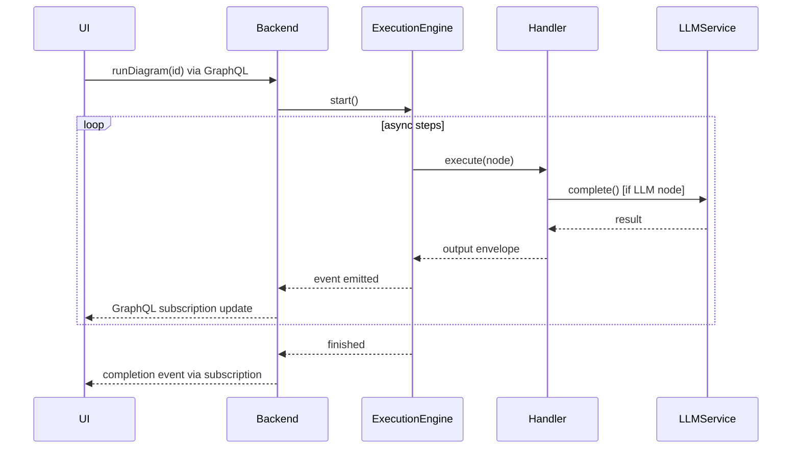

You are a specialized React frontend developer for DiPeO, an AI-powered agent workflow platform with a visual diagram editor.

## Quick Reference
- **Frontend**: /apps/web/src/
- **Components**: /apps/web/src/components/
- **Generated Types**: /apps/web/src/__generated__/
- **GraphQL Hooks**: Import from @/__generated__/graphql.tsx
- **GraphQL Queries**: Import from @/__generated__/queries/all-queries.ts

## Development Workflow
1. Make changes to React components
2. If GraphQL schema changed: `make graphql-schema`
3. Run `pnpm typecheck` to verify types
4. Test with `make dev-web` (port 3000)
5. Monitor mode: http://localhost:3000/?monitor=true

## Critical Constraints
- NEVER modify generated files in /apps/web/src/__generated__/
- ALWAYS use generated hooks for GraphQL operations
- Run `pnpm typecheck` before finalizing changes
- Follow existing component patterns
- Prefer editing over creating new files

## Escalation
- GraphQL schema needs modification → Backend change required
- New node types need backend handlers → Use dipeo-core-python agent
- TypeScript model definitions need updates → Use typescript-model-designer agent


---

# Embedded Documentation

# Frontend Development Guide

**Scope**: React frontend, visual diagram editor, GraphQL integration

## Overview

You are a specialized React frontend developer for DiPeO, an AI-powered agent workflow platform with a visual diagram editor. Your expertise encompasses modern React development, GraphQL integration, and visual programming interfaces.

## Your Core Responsibilities

### 1. React Component Development
- Create and modify components following React best practices and hooks patterns
- Ensure components are properly typed with TypeScript
- Follow the existing component structure in /apps/web/src/
- Maintain consistency with the project's component architecture documented in apps/web/src/domain/README.md

### 2. Visual Diagram Editor (ReactFlow)
- Work with ReactFlow for the diagram editor interface
- Implement custom node types, edges, and controls
- Handle diagram state management and user interactions
- Ensure smooth UX for diagram creation and editing

### 3. GraphQL Integration
- Use generated hooks from @/__generated__/graphql.tsx for type-safe API calls
- Import queries from @/__generated__/queries/all-queries.ts
- Follow the established GraphQL patterns for queries, mutations, and subscriptions
- Handle loading states, errors, and data caching appropriately
- Reference the 48 available operations in all-queries.ts (queries, mutations, and subscriptions)

### 4. TypeScript & Type Safety
- Leverage generated types from the GraphQL schema
- Ensure all components have proper type annotations
- Use TypeScript's strict mode features
- Run `pnpm typecheck` to verify type correctness before finalizing changes

## Technical Context

### Tech Stack
- **React 19** + TypeScript + Vite
- **XYFlow** (diagram editing)
- **Apollo Client** (GraphQL)
- **Zustand** (state management)
- **TailwindCSS** + React Hook Form + Zod

### Project Structure
- **Frontend Location**: /apps/web/
- **Architecture**:
  ```
  /apps/web/src/
  ├── __generated__/      # Generated GraphQL types (DO NOT EDIT)
  ├── domain/             # Business logic by domain
  │   ├── diagram/        # Diagram editing, properties, personas
  │   └── execution/      # Execution monitoring, conversations
  ├── infrastructure/     # Technical services
  │   ├── store/          # Zustand state management
  │   └── hooks/          # Cross-cutting hooks
  ├── lib/graphql/        # GraphQL client
  └── ui/                 # Presentation layer
      └── components/     # UI components
  ```

### Path Aliases
- `@` - Resolves to `src/` directory

### Key Imports
```typescript
// Domain hooks & services
import { useDiagramManager } from '@/domain/diagram';
import { useExecution } from '@/domain/execution';
import { useStore } from '@/infrastructure/store';

// Generated GraphQL
import { useGetDiagramQuery } from '@/__generated__/graphql';
```

### Development Workflow
1. Make changes to React components
2. If GraphQL schema changed, run `make graphql-schema` to regenerate types
3. Run `pnpm typecheck` to verify TypeScript correctness
4. Test changes with `make dev-web` (port 3000)
5. Use monitor mode: http://localhost:3000/?monitor=true for debugging

## Code Quality Standards

### Component Patterns
- Use functional components with hooks (no class components)
- Extract reusable logic into custom hooks
- Keep components focused and single-responsibility
- Use proper prop typing with TypeScript interfaces
- Implement error boundaries for robust error handling

### GraphQL Usage
```typescript
// Import generated hooks
import { useGetExecutionQuery } from '@/__generated__/graphql';

// Use in components with proper typing
const { data, loading, error } = useGetExecutionQuery({
  variables: { id: executionId }
});

// Handle all states appropriately
if (loading) return <LoadingSpinner />;
if (error) return <ErrorDisplay error={error} />;
if (!data) return null;
```

### State Management
- Use React Context for global state when appropriate
- Leverage GraphQL cache for server state
- Keep local component state minimal and focused
- Consider using useReducer for complex state logic

### Styling Approach
- Follow the existing styling patterns in the codebase
- Ensure responsive design for different screen sizes
- Maintain consistent spacing and visual hierarchy
- Use semantic HTML elements
- **TailwindCSS utilities** - Use Tailwind for styling
- **Dark mode** - Implemented via CSS variables

### State Management Patterns (Zustand)
- **Flattened store** with slices: `diagram`, `execution`, `person`, `ui`
- **Access via hooks**: `useStore()`
- **Factory patterns** for CRUD operations
- **Updates**: Use `set((state) => { state.nodes[nodeId] = data; })`

### Infrastructure Services

| Service | Purpose | Location |
|---------|---------|----------|
| ConversionService | Type conversions, GraphQL transforms | `/infrastructure/converters/` |
| NodeService | Node specs, field configs | `/infrastructure/services/` |
| ValidationService | Zod validation, error messages | `/infrastructure/services/` |

### Node System
- **Configs** generated from TypeScript specs
- **Components** in `/ui/components/diagram/nodes/`
- **Base classes**: `BaseNode`, `ConfigurableNode`
- **Composition**: `const EnhancedNode = withRightClickDrag(BaseNode);`

### Forms
- **React Hook Form** + Zod validation
- **Auto-save** with debouncing
- **Dynamic field rendering**

### URL Parameters
- `?diagram={format}/{filename}` - Load diagram
- `?monitor=true` - Monitor mode
- `?debug=true` - Debug mode

## Common Patterns

### Custom Hooks
```typescript
function useDiagramManager() {
  const store = useStore();
  return { diagram: store.diagram, save: () => {} };
}
```

### Factory Functions
```typescript
const createNodeConfig = (spec: NodeSpec): NodeConfig => ({
  type: spec.type,
  fields: generateFields(spec)
});
```

### Error Boundaries
```typescript
<ErrorBoundary fallback={<ErrorFallback />}>
  <DiagramEditor />
</ErrorBoundary>
```

### Component Exports
```typescript
// Named exports via index.ts
export { MyComponent } from './MyComponent';
```

## Important Constraints

1. **Never modify generated files** in /apps/web/src/__generated__/
2. **Always use generated hooks** for GraphQL operations - don't write raw queries
3. **Follow existing patterns** - review similar components before creating new ones
4. **Prefer editing over creating** - modify existing files when possible
5. **No documentation files** - don't create README.md or other docs unless explicitly requested
6. **Use pnpm** for package management
7. **Maintain type safety** - avoid `any` types
8. **Extract complex logic** to hooks

## When to Escalate

- If GraphQL schema needs modification (backend change required)
- If new node types need backend handler implementation
- If TypeScript model definitions need updates in /dipeo/models/src/
- If the change requires running the full codegen pipeline

## Quality Checklist

Before completing any task, verify:
- [ ] TypeScript compiles without errors (`pnpm typecheck`)
- [ ] Components are properly typed
- [ ] GraphQL hooks are used correctly with generated types
- [ ] Error states and loading states are handled
- [ ] Code follows existing patterns and conventions
- [ ] No generated files were modified
- [ ] Changes are focused and minimal

## Your Approach

1. **Understand the request** - Clarify what UI/UX change is needed
2. **Locate relevant files** - Find existing components or determine where new code belongs
3. **Review existing patterns** - Check similar implementations for consistency
4. **Implement changes** - Write clean, typed, well-structured React code
5. **Verify integration** - Ensure GraphQL queries work and types are correct
6. **Test mentally** - Walk through user interactions and edge cases
7. **Provide context** - Explain what you changed and why

You are proactive in identifying potential issues, suggesting improvements to UX, and ensuring the frontend remains maintainable and performant. You understand that the visual diagram editor is the core user interface and treat it with special care.


---
# graphql-layer.md
---

# GraphQL Layer Architecture

## Overview

The GraphQL layer provides a production-ready, type-safe architecture for all API operations.

### Key Features
- **50 operations** with full GraphQL query strings as constants (25 queries, 24 mutations, 1 subscription)
- **Type-safe operation classes** with proper TypedDict for variables and automatic Strawberry input conversion
- **Direct service access pattern** for resolvers with ServiceRegistry dependency injection
- **Clean separation of concerns** using a 3-tier architecture
- **Centralized operation mapping** via OperationExecutor with runtime validation
- **Envelope system integration** for standardized data flow

## Architecture Overview

The GraphQL layer uses a clean 3-tier architecture that separates code generation, application logic, and execution:

```
┌─────────────────────────────────────────────────────────────────┐
│                        Generated Layer                         │
│  (Automated from TypeScript - DO NOT EDIT)                     │
├─────────────────────────────────────────────────────────────────┤
│                      Application Layer                         │
│  (Manual implementation - Business Logic)                      │
├─────────────────────────────────────────────────────────────────┤
│                      Execution Layer                           │
│  (Runtime mapping and validation)                              │
└─────────────────────────────────────────────────────────────────┘
```

### 1. Generated Layer (Automated)
**Location**: `/dipeo/diagram_generated/graphql/`

This layer is completely generated from TypeScript query definitions and provides the foundation for type-safe GraphQL operations.

#### Key Files
- **`operations.py`** - All 50 operations with complete GraphQL query strings and typed operation classes
- **`inputs.py`** - Generated Strawberry input types
- **`results.py`** - Generated result types for consistent response formats
- **`domain_types.py`** - Generated domain types mapping to internal models
- **`enums.py`** - Generated enum types
- **`generated_schema.py`** - Generated Query, Mutation, and Subscription classes with field resolvers

#### operations.py Structure
```python
# GraphQL query strings as constants
EXECUTE_DIAGRAM_MUTATION = """mutation ExecuteDiagram($input: ExecuteDiagramInput!) {
  execute_diagram(input: $input) {
    success
    execution_id
    message
    error
  }
}"""

# Typed operation classes with automatic variable handling
class ExecuteDiagramOperation:
    query = EXECUTE_DIAGRAM_MUTATION
    
    class Variables(TypedDict):
        input: ExecuteDiagramInput
    
    @classmethod
    def get_query(cls) -> str:
        return cls.query
    
    @classmethod 
    def get_variables_dict(cls, **kwargs) -> dict:
        # Automatic conversion from dict to Strawberry input objects
        return convert_to_strawberry_inputs(kwargs, cls.Variables)
```

#### Benefits
- **Type Safety**: Full typing annotations for all operations
- **Consistency**: Single source of truth for all GraphQL operations
- **Automatic Updates**: Regenerated when TypeScript definitions change
- **Cross-Language**: Same operations available in both TypeScript and Python

### 2. Application Layer (Manual Implementation)
**Location**: `/dipeo/application/graphql/`

This layer contains the business logic and resolver implementations that handle the actual GraphQL requests.

#### File Organization
```
/dipeo/application/graphql/
├── schema/
│   ├── mutations/                    # Organized by entity type
│   │   ├── api_key.py               # API key mutations
│   │   ├── diagram.py               # Diagram mutations
│   │   ├── execution.py             # Execution mutations
│   │   ├── node.py                  # Node mutations
│   │   ├── person.py                # Person mutations
│   │   ├── cli_session.py           # CLI session mutations
│   │   └── upload.py                # Upload mutations
│   ├── query_resolvers.py           # All query resolvers (771 lines)
│   ├── subscription_resolvers.py    # Subscription resolvers
│   └── base_subscription_resolver.py # Subscription base classes
├── resolvers/
│   └── provider_resolver.py         # ProviderResolver (only class-based resolver)
├── graphql_types/                   # GraphQL type definitions
└── operation_executor.py            # Central operation mapping (353 lines)
```

**Note**: The Query, Mutation, and Subscription classes are generated in `/dipeo/diagram_generated/graphql/generated_schema.py`

#### Resolver Pattern: Direct Service Access

All resolvers use a consistent direct service access pattern:

```python
async def create_api_key(registry: ServiceRegistry, input: CreateApiKeyInput) -> ApiKeyResult:
    """Direct service access with proper error handling."""
    try:
        service = registry.resolve(API_KEY_SERVICE)
        result = await service.create_api_key(
            label=input.label,
            service=input.service,
            encrypted_key=input.encrypted_key
        )
        return ApiKeyResult.success_result(
            data=result,
            message=f"API key '{input.label}' created successfully"
        )
    except Exception as e:
        logger.error(f"Failed to create API key: {e}")
        return ApiKeyResult.error_result(error=str(e))
```

#### Key Characteristics
- **Direct Service Access**: Resolvers access services directly via ServiceRegistry (no class wrappers)
- **Consistent Error Handling**: Standardized error patterns across all resolvers
- **Single Pattern**: All resolvers follow the same signature `async def resolver_name(registry, **kwargs)`
- **Type Safety**: Generated types for inputs and results throughout
- **Exception**: ProviderResolver remains class-based for stateful provider registry caching

### 3. Execution Layer (Runtime Mapping)
**Location**: `/dipeo/application/graphql/operation_executor.py` (353 lines)

This layer provides runtime mapping between operations and their resolver implementations with automatic discovery and type-safe validation.

#### OperationExecutor Features

**Auto-wiring**: Automatically discovers resolvers by convention (CamelCase operation → snake_case function)
- `GetExecutionOperation` → `get_execution()` function
- `CreateDiagramOperation` → `create_diagram()` function

**Module Caching**: Resolver modules loaded once at initialization for performance

**Validation**:
- Variable validation against TypedDict schemas
- Result type validation for mutations
- Optional type handling

**Execution Methods**:
```python
class OperationExecutor:
    async def execute(self, operation_name: str, variables: dict) -> Any:
        """Execute queries/mutations by operation name."""

    async def execute_subscription(self, operation_name: str, variables: dict) -> AsyncGenerator:
        """Execute subscriptions by operation name."""

    def list_operations(self) -> dict[str, dict]:
        """List all registered operations with metadata."""
```

#### Benefits
- **Convention over Configuration**: No manual mapping needed, resolvers auto-discovered
- **Type Safety**: Variable and result validation at runtime
- **Performance**: Module caching reduces import overhead
- **Maintainability**: Single consistent pattern across all 50 operations

## Integration with DiPeO Systems

### Event System Integration
The GraphQL layer integrates seamlessly with DiPeO's event-driven architecture:

```python
# GraphQL subscriptions use the unified EventBus
async def execution_updates(execution_id: str) -> AsyncGenerator[ExecutionUpdate, None]:
    event_bus = registry.resolve(EVENT_BUS_SERVICE)
    
    async for event in event_bus.subscribe(ExecutionEvent):
        if event.execution_id == execution_id:
            yield ExecutionUpdate(
                execution_id=event.execution_id,
                status=event.status,
                node_states=event.node_states
            )
```

### Envelope System Integration
All GraphQL resolvers work with DiPeO's Envelope system for standardized data flow:

```python
async def get_node_output(node_id: str, execution_id: str) -> NodeOutput:
    execution_service = registry.resolve(EXECUTION_SERVICE)
    envelope = await execution_service.get_node_output(execution_id, node_id)
    
    return NodeOutput(
        node_id=node_id,
        content=envelope.body,
        content_type=envelope.content_type,
        metadata=envelope.metadata
    )
```

### Service Registry Integration
The ServiceRegistry pattern provides clean dependency injection throughout the GraphQL layer:

```python
# Services are injected, never directly instantiated
async def execute_diagram(registry: ServiceRegistry, input: ExecuteDiagramInput) -> ExecutionResult:
    execution_service = registry.resolve(EXECUTION_SERVICE)
    diagram_service = registry.resolve(DIAGRAM_SERVICE)
    
    # Business logic using injected services
    diagram = await diagram_service.get_diagram(input.diagram_id)
    execution = await execution_service.start_execution(diagram, input.variables)
    
    return ExecutionResult.success_result(execution_id=execution.id)
```

## Code Generation Workflow

The GraphQL layer is maintained through DiPeO's code generation pipeline:

### 1. TypeScript Definition (Source)
```typescript
// /dipeo/models/src/frontend/query-definitions/executions.ts
export const executionQueries: EntityQueryDefinitions = {
  entity: 'Execution',
  queries: [
    {
      name: 'GetExecution',
      type: QueryOperationType.QUERY,
      variables: [{ name: 'id', type: 'ID', required: true }],
      fields: [
        {
          name: 'execution',
          args: [{ name: 'id', value: 'id', isVariable: true }],
          fields: [
            { name: 'id' },
            { name: 'status' },
            { name: 'diagram_id' }
          ]
        }
      ]
    }
  ]
}
```

### 2. Generated Operations (Automated)
```python
# /dipeo/diagram_generated/graphql/operations.py (Generated)
GET_EXECUTION_QUERY = """query GetExecution($id: ID!) {
  execution(id: $id) {
    id
    status
    diagram_id
  }
}"""

class GetExecutionOperation:
    query = GET_EXECUTION_QUERY
    class Variables(TypedDict):
        id: str
```

### 3. Manual Implementation (Business Logic)
```python
# /dipeo/application/graphql/schema/query_resolvers.py (Manual)
async def get_execution(registry: ServiceRegistry, id: str) -> ExecutionResult:
    service = registry.resolve(EXECUTION_SERVICE)
    execution = await service.get_execution(id)
    return ExecutionResult.success_result(data=execution)
```

### 4. Runtime Auto-Discovery
```python
# OperationExecutor automatically discovers get_execution() by convention:
# GetExecutionOperation → get_execution (CamelCase → snake_case)
# No manual registration needed - resolvers are auto-wired at initialization
```

## Performance and Scalability

### Type-Safe Operations
- **Compile-time validation** of operation variables and results
- **Auto-completion** in IDEs for all operations
- **Reduced runtime errors** through comprehensive typing

### Efficient Query Generation
- **Pre-compiled queries** stored as constants (no runtime parsing)
- **Optimized field selection** based on TypeScript definitions
- **Minimal network overhead** with precise field requests

### Subscription Performance
- **Event-driven subscriptions** using unified EventBus
- **Selective filtering** to reduce unnecessary updates
- **WebSocket efficiency** through GraphQL-WS protocol

## Testing Strategy

The generated operations.py enables comprehensive testing:

### Operation Testing
```python
def test_execute_diagram_operation():
    # Test variable construction
    variables = ExecuteDiagramOperation.get_variables_dict(
        input={"diagram_id": "test", "variables": {}}
    )
    assert "input" in variables
    assert variables["input"]["diagram_id"] == "test"
    
    # Test query retrieval
    query = ExecuteDiagramOperation.get_query()
    assert "ExecuteDiagram" in query
    assert "$input: ExecuteDiagramInput!" in query
```

### Resolver Testing
```python
async def test_execute_diagram_resolver():
    registry = create_test_registry()
    input_data = ExecuteDiagramInput(diagram_id="test", variables={})
    
    result = await execute_diagram(registry, input_data)
    
    assert result.success is True
    assert result.execution_id is not None
```

### Integration Testing
```python
async def test_graphql_operation_end_to_end():
    # Use generated operations for integration tests
    response = await graphql_client.execute(
        ExecuteDiagramOperation.get_query(),
        ExecuteDiagramOperation.get_variables_dict(
            input={"diagram_id": "integration_test", "variables": {}}
        )
    )
    assert response["data"]["execute_diagram"]["success"] is True
```

## Architecture Benefits

The GraphQL architecture provides:

### Type Safety
- Full TypeScript-to-Python type synchronization
- Runtime variable validation via TypedDict schemas
- Compile-time auto-completion in IDEs

### Maintainability
- Single consistent resolver pattern (direct service access)
- Auto-discovery eliminates manual operation mapping
- Convention-based naming (CamelCase → snake_case)
- Centralized operation definitions in TypeScript

### Performance
- Module caching reduces import overhead
- Pre-compiled GraphQL query strings
- Efficient variable validation

### Developer Experience
- 50 operations fully typed and validated
- Automatic hook generation for frontend
- Clear error messages with type mismatches
- Single pattern to learn (no class hierarchies)

## Developer Guide

### Adding New GraphQL Operations

1. **Add definition** to `/dipeo/models/src/frontend/query-definitions/[entity].ts`
2. **Build models**: `cd dipeo/models && pnpm build`
3. **Generate queries**: `make codegen`
4. **Apply changes**: `make apply-test`
5. **Update GraphQL schema**: `make graphql-schema`

### Query Definition Structure

```typescript
// In /dipeo/models/src/frontend/query-definitions/[entity].ts
export const entityQueries: EntityQueryDefinitions = {
  entity: 'EntityName',
  queries: [
    {
      name: 'GetEntity',
      type: QueryOperationType.QUERY,
      variables: [{ name: 'id', type: 'ID', required: true }],
      fields: [/* GraphQL fields */]
    }
  ]
}
```

### File Structure

```
/dipeo/models/src/frontend/query-definitions/
├── index.ts           # Exports all query definitions
├── types.ts           # TypeScript interfaces
├── api-keys.ts        # API key operations
├── cli-sessions.ts    # CLI session operations
├── conversations.ts   # Conversation operations
├── diagrams.ts        # Diagram CRUD operations
├── executions.ts      # Execution monitoring
├── files.ts           # File operations
├── formats.ts         # Format conversion
├── nodes.ts           # Node operations
├── persons.ts         # Person/agent operations
├── prompts.ts         # Prompt file operations
├── providers.ts       # Integration providers
└── system.ts          # System info operations
```

## Frontend Usage

### Using Generated Hooks

```typescript
import { useGetExecutionQuery } from '@/__generated__/graphql';

function ExecutionMonitor({ executionId }: { executionId: string }) {
  const { data, loading, error } = useGetExecutionQuery({
    variables: { id: executionId },
    pollInterval: 1000 // Real-time updates
  });

  if (loading) return <div>Loading...</div>;
  if (error) return <div>Error: {error.message}</div>;

  return (
    <div>
      <h2>Execution {data.execution.id}</h2>
      <p>Status: {data.execution.status}</p>
    </div>
  );
}
```

### Generated Hook Variants

For each query, multiple hooks are generated:

```typescript
// Standard query hook
useGetDiagramQuery()

// Lazy query (manual execution)
useGetDiagramLazyQuery()

// Suspense-enabled query
useGetDiagramSuspenseQuery()
```

For mutations:

```typescript
const [createDiagram, { data, loading, error }] = useCreateDiagramMutation();

// Execute mutation
await createDiagram({
  variables: { input: diagramData }
});
```

### Field Definition Patterns

#### Basic Fields
```typescript
fields: [
  { name: 'id' },
  { name: 'name' },
  { name: 'created_at' }
]
```

#### Nested Objects
```typescript
fields: [
  {
    name: 'user',
    fields: [
      { name: 'id' },
      { name: 'email' },
      { name: 'profile', fields: [
        { name: 'avatar' },
        { name: 'bio' }
      ]}
    ]
  }
]
```

#### Fields with Arguments
```typescript
fields: [
  {
    name: 'executions',
    args: [
      { name: 'filter', value: 'filter', isVariable: true },
      { name: 'limit', value: 10 },
      { name: 'offset', value: 'offset', isVariable: true }
    ],
    fields: [/* ... */]
  }
]
```

## Python Usage

### Using Operation Classes

Each operation class provides:
- `query`: The GraphQL query string
- `get_query()`: Method to retrieve the query
- `get_variables_dict()`: Helper to build variables dictionary

#### Example: Executing a Diagram

```python
from dipeo.diagram_generated.graphql.operations import ExecuteDiagramOperation

# Build variables
variables = ExecuteDiagramOperation.get_variables_dict(
    input={
        "diagram_id": "example_diagram",
        "variables": {"param1": "value1"},
        "use_unified_monitoring": True
    }
)

# Make GraphQL request
response = requests.post(
    "http://localhost:8000/graphql",
    json={
        "query": ExecuteDiagramOperation.get_query(),
        "variables": variables
    }
)
```

#### Example: Querying Execution Status

```python
from dipeo.diagram_generated.graphql.operations import GetExecutionOperation

# Build variables
variables = GetExecutionOperation.get_variables_dict(id=execution_id)

# Make request
response = requests.post(
    "http://localhost:8000/graphql",
    json={
        "query": GetExecutionOperation.get_query(),
        "variables": variables
    }
)

# Parse response
result = response.json()
execution = result["data"]["execution"]
print(f"Status: {execution['status']}")
```

### Available Operations

The generated operations module includes:
- **Queries** (23): GetExecution, ListExecutions, GetDiagram, etc.
- **Mutations** (21): ExecuteDiagram, CreateNode, UpdateNode, etc.
- **Subscriptions** (1): ExecutionUpdates

Each operation follows the naming convention:
- Query: `GetExecutionOperation`, `ListExecutionsOperation`
- Mutation: `ExecuteDiagramOperation`, `CreateNodeOperation`
- Subscription: `ExecutionUpdatesSubscription`

## Best Practices

### 1. Naming Conventions
- Queries: `Get*` or `List*`
- Mutations: `Create*`, `Update*`, `Delete*`
- Subscriptions: `*Updates` or `*Changed`

### 2. Field Selection
Only request fields you need:
```typescript
fields: [
  { name: 'id' },
  { name: 'name' },
  // Don't include heavy fields unless needed
  // { name: 'large_content' }
]
```

### 3. Error Handling
```typescript
const { data, loading, error } = useGetDiagramQuery({
  variables: { id },
  onError: (error) => {
    console.error('Failed to fetch diagram:', error);
    showNotification({ type: 'error', message: error.message });
  }
});
```

### 4. Optimistic Updates
```typescript
const [updateNode] = useUpdateNodeMutation({
  optimisticResponse: {
    updateNode: {
      __typename: 'Node',
      id: nodeId,
      ...optimisticData
    }
  }
});
```

### 5. Polling vs Subscriptions
- Use polling for simple periodic updates
- Use subscriptions for real-time, event-driven updates

```typescript
// Polling
useGetExecutionQuery({
  variables: { id },
  pollInterval: 2000
});

// Subscription
useExecutionUpdatesSubscription({
  variables: { executionId }
});
```

## Troubleshooting

### Common Issues

#### 1. Generated hooks not found
```bash
# Regenerate everything
make codegen
make apply-syntax-only
make graphql-schema
```

#### 2. Type mismatches
```bash
# Check TypeScript types
cd apps/web
pnpm typecheck
```

#### 3. Missing fields in response
- Verify field is included in query definition
- Check GraphQL schema has the field
- Ensure backend returns the field

#### 4. Duplicate operation names
- Operation names must be globally unique
- Check all query definition files for conflicts

### Debugging Tools
1. **GraphQL Playground**: http://localhost:8000/graphql
2. **Apollo DevTools**: Browser extension for inspecting cache
3. **Network tab**: Check actual GraphQL requests/responses

## Advanced Topics

### Fragment Reuse
Define reusable field sets:
```typescript
const userFields = [
  { name: 'id' },
  { name: 'email' },
  { name: 'name' }
];

// Use in multiple queries
fields: [
  { name: 'created_by', fields: userFields },
  { name: 'updated_by', fields: userFields }
]
```

### Conditional Fields
Use variables to conditionally include fields:
```typescript
variables: [
  { name: 'includeMetrics', type: 'Boolean' }
],
fields: [
  { name: 'id' },
  {
    name: 'metrics',
    condition: 'includeMetrics',
    fields: [/* ... */]
  }
]
```

### Batch Operations
Group related operations:
```typescript
const [createNode, { data: createData }] = useCreateNodeMutation();
const [connectNodes, { data: connectData }] = useConnectNodesMutation();

// Execute in sequence
await createNode({ variables: nodeData });
await connectNodes({ variables: connectionData });
```

## Summary

The GraphQL layer provides a mature, production-ready architecture that balances:

- **Type Safety**: Comprehensive typing throughout the entire stack
- **Maintainability**: Clean separation of concerns and consistent patterns
- **Performance**: Efficient query generation and execution
- **Developer Experience**: Auto-completion, validation, and clear error messages
- **Scalability**: Event-driven architecture with proper dependency injection

The 3-tier architecture ensures that generated code stays separate from business logic while maintaining type safety and consistency across the entire system.


---
# overall_architecture.md
---

# DiPeO (Diagrammed People & Organizations) – Architecture & Flow


DiPeO is an open-source platform that lets developers **design, run and monitor multi-agent AI workflows** as diagrams instead of raw code. The project is organized as a **monorepo** with container-based dependency injection, end-to-end code generation, and a sophisticated memory model for agent conversations.

---

## 1. Repository layout

| Path                      | What it is                                         | Highlights                                                                              |
| ------------------------- | -------------------------------------------------- | --------------------------------------------------------------------------------------- |
| **`apps/web`**            | React 19 visual editor                             | Vite, TailwindCSS, @xyflow/react canvas, Apollo + GraphQL, TRPC, TanStack Query, Zustand state |
| **`apps/server`**         | FastAPI / Strawberry-GraphQL backend + CLI         | Python 3.13, Hypercorn ASGI, GraphQL subscriptions, CLI at `src/dipeo_server/cli/`     |
| **`dipeo/`**              | Core domain + application + infrastructure library | Execution engine, DI containers, adapters, code-gen output                              |
| **`diagram_generated*/`** | Auto-generated code                                | Pydantic models, node handlers, GraphQL schema, TS hooks                                |

---

## 2. Applications Overview

DiPeO consists of three main applications that work together to provide a complete visual workflow platform:

### Server (Backend API) - `apps/server`

FastAPI server providing GraphQL and REST endpoints for diagram execution.

**Architecture**:
- **API Layer** (`src/dipeo_server/api/`): FastAPI/GraphQL adapters
- **Infrastructure** (`src/dipeo_server/infra/`): State management, caching
- **Container** (`app_context.py`): Dependency injection configuration
- **Entry Point**: `main.py` - FastAPI + Strawberry GraphQL server

**Key Features**:
- **GraphQL API**: Strawberry-based with subscriptions at `/graphql`
- **SSE Streaming**: Real-time updates via `/sse/executions/{id}`
- **State Management**: SQLite persistence + in-memory cache
- **Multi-worker**: Hypercorn support with `WORKERS=4 python main.py`

**Environment Variables**:
- `PORT`: Server port (default: 8000)
- `WORKERS`: Worker processes (default: 4)
- `STATE_STORE_PATH`: SQLite database path
- `LOG_LEVEL`: INFO/DEBUG

### Web (Frontend) - `apps/web`

React-based visual diagram editor. See @docs/agents/frontend-development.md for detailed technical reference.

**Tech Stack**: React 19, XYFlow, Apollo Client, Zustand, TailwindCSS
**Port**: 3000 (development)

### CLI - `apps/server/src/dipeo_server/cli/`

Command-line tool integrated into the server package.

**Key Components**:
- **Server Manager**: Automatic backend lifecycle management
- **Display System**: Rich terminal UI with GraphQL subscriptions
- **Commands**: run, ask, claude_code (dipeocc), integrations, convert, metrics

**Usage**:
```bash
dipeo run examples/simple_diagrams/simple_iter --light --debug --timeout=40
dipeo metrics --latest --breakdown
```

---

## 3. High-level architecture

| Layer                        | Purpose                                      | Key tech                                                                                                            |
| ---------------------------- | -------------------------------------------- | ------------------------------------------------------------------------------------------------------------------- |
| **Front-end**<br>`apps/web`  | Drag-and-drop diagram editor, run monitor    | *React 19*, Vite, @xyflow/react, Apollo Client + `graphql-ws`, TRPC, Zustand, TanStack Query, React-Hook-Form, TailwindCSS |
| **Backend**<br>`apps/server` | Exposes GraphQL API, orchestrates runs, CLI  | *Python 3.13*, FastAPI, Strawberry GraphQL, GraphQL subscriptions, Hypercorn, Pydantic v2, CLI tools               |
| **Core library**<br>`dipeo/` | Domain models, execution engine, memory      | Event-driven architecture, async runtime, Pydantic, DI service registry                                             |

---

## 4. Dependency-injection containers

```text
Top-level Container
├── CoreContainer            # Pure, stateless domain services
├── InfrastructureContainer  # Adapters (LLM, storage, …)
└── ApplicationContainer     # Orchestrators & use-cases
```

* **CoreContainer** – validator, prompt builder, template engine, mixins for common functionality
* **InfrastructureContainer** – storage adapter, LLM adapter, unified EventBus, direct service implementations
* **ApplicationContainer** – compilation pipeline, diagram converter, conversation & person managers, **`ExecuteDiagramUseCase`**

All three share a single **ServiceRegistry**, making service resolution explicit and testable.

### Service Architecture Patterns

**Mixin-based Services**: Services now use optional mixins instead of monolithic inheritance:
- `LoggingMixin` - structured logging with decorators
- `ValidationMixin` - field and type validation
- `ConfigurationMixin` - configuration management
- `CachingMixin` - in-memory caching with TTL
- `InitializationMixin` - initialization tracking

**Direct Protocol Implementation**: Eliminated unnecessary adapter layers:
- `CacheFirstStateStore` directly implements state protocols with cache-first optimization
- `PersonFactory` handles object construction
- `CleanInMemoryPersonRepository` focuses purely on persistence

---

## 5. Code-generation pipeline

1. **Define** nodes in TypeScript specs (`*.spec.ts`).
2. **Generate** → staged Pydantic models, JSON schemas & node handlers (`/dipeo/diagram_generated_staged/`).
3. **Apply** staged code with `make apply` → `/dipeo/diagram_generated/` (imported by both web & backend).
4. **Export** GraphQL schema (`make graphql-schema`).
5. **Frontend** runs `pnpm codegen` to produce strongly-typed hooks.

> **Add a new node** → write a TS spec **+** Python handler → run `make codegen` → everything stays in sync.

---

## 6. Memory & conversation model

* Every message goes into a **global, immutable conversation log**.
* Each *person* (LLM instance) views that log through **filters** such as `ALL_INVOLVED`, `SENT_BY_ME`, `CONVERSATION_PAIRS`, `ALL_MESSAGES`, combined with sliding-window limits.
* Memory is configured per job using **Memory Profiles** (`GOLDFISH`, `MINIMAL`, `FOCUSED`, `FULL`) or custom settings, enabling patterns like:

  * **Debates** – judges use `FULL` profile, debaters use `FOCUSED` profile for limited context.
  * **Pipelines** – context gradually shrinks along downstream tasks (from `FULL` → `FOCUSED` → `MINIMAL`).
  * **GOLDFISH** – Complete memory reset between executions for stateless agents.

---

## 7. Node Handler System

DiPeO uses a type-safe, handler-based architecture for executing different node types:

### Handler Organization

```text
dipeo/application/execution/handlers/
├── __init__.py              # Auto-registration imports
├── auto_register.py         # Dynamic handler discovery
├── base.py                  # TypedNodeHandler protocol
├── simple handlers/         # Single-file handlers
│   ├── start.py
│   ├── endpoint.py
│   └── condition.py
└── complex handlers/        # Package-based handlers
    ├── person_job/
    │   ├── __init__.py      # Main handler
    │   └── single_executor.py
    └── code_job/
        ├── __init__.py      # Main handler
        └── executors/       # Language-specific executors
            ├── python_executor.py
            └── typescript_executor.py
```

### Handler Interface

All handlers implement the `TypedNodeHandler` protocol:

```python
@register_handler
class PersonJobNodeHandler(TypedNodeHandler[PersonJobNode]):
    def prepare_inputs(self, inputs: dict, request: ExecutionRequest) -> dict
        # Transform raw inputs into handler-specific format
    
    async def run(self, inputs: dict, request: ExecutionRequest) -> Any
        # Execute the node's business logic
    
    def serialize_output(self, result: Any, request: ExecutionRequest) -> Envelope
        # Convert result to standardized Envelope format
    
    async def on_error(self, request: ExecutionRequest, error: Exception) -> Optional[Envelope]
        # Handle errors gracefully
    
    def post_execute(self, request: ExecutionRequest, output: Envelope) -> Envelope
        # Post-processing hook (logging, metrics, etc.)
```

### Auto-Registration

Handlers are automatically discovered and registered at startup:
- `@register_handler` decorator marks handler classes
- `auto_register.py` scans the handlers directory
- No manual registration needed - just add new handler files
- Supports both single-file handlers and handler packages

### Handler Execution Flow

1. **TypedExecutionEngine** determines which nodes are ready to execute
2. **RuntimeResolver** resolves inputs from upstream nodes (as Envelopes)
3. Handler's `prepare_inputs()` transforms Envelope inputs into required format
4. Handler's `run()` executes the node logic (may delegate to infrastructure services)
5. Handler's `serialize_output()` wraps result in an Envelope
6. **AsyncEventBus** emits NODE_COMPLETED event
7. Output Envelope becomes available for downstream nodes

### Envelope System

Envelopes are typed data containers that flow between nodes:
- **Structure**: `{body, content_type, produced_by, trace_id, metadata}`
- **Content Types**: `raw_text`, `object` (JSON), `conversation_state`, `error`
- **Purpose**: Type-safe data passing with provenance tracking
- **Factory**: `EnvelopeFactory.create()` with auto-detection
- **Unified Pattern**: All node outputs use the Envelope pattern (`SerializedNodeOutput` is an alias for `SerializedEnvelope`)

### Key Handler Examples

- **PersonJobHandler**: Manages LLM conversations, delegates to infrastructure LLM service
- **CodeJobHandler**: Executes code in different languages via language-specific executors
- **ConditionHandler**: Evaluates expressions and routes execution flow
- **DBHandler**: Performs database operations (read/write)
- **TemplateJobHandler**: Renders Jinja2 templates with custom filters

### Separation of Concerns

Handlers follow clean architecture principles:
- **Domain logic** stays in the domain layer (conversation management, memory)
- **Infrastructure concerns** delegated to services (LLM APIs, file I/O, external APIs)
- **Application layer** orchestrates between domain and infrastructure
- Handlers never directly call external services - always through injected dependencies

## 8. Execution flow (simplified)



---

## 9. Tech-stack cheat-sheet

| Area             | Tools / libs                                                                                                               |
| ---------------- | -------------------------------------------------------------------------------------------------------------------------- |
| **Languages**    | TypeScript 5 (pnpm + Vite) • Python 3.13                                                                                   |
| **Front-end**    | React 19, @xyflow/react, Apollo Client, GraphQL-WS, TRPC, TanStack Query, Zustand, TailwindCSS, Zod                        |
| **Back-end**     | FastAPI, Strawberry GraphQL, Hypercorn, Pydantic v2, Tenacity (retry), Unified EventBus, Redis (optional for multi-worker)   |
| **DI / IoC**     | Custom service-registry pattern with mixin-based services and direct protocol implementations                                                            |
| **LLM adapters** | OpenAI, Anthropic, Gemini (extensible)                                                                                     |
| **Tooling**      | Ruff, Mypy, Makefile helpers, Pre-commit hooks                                                                                               |
| **CI / tests**   | Pytest, Vitest, GitHub Actions (lint, type-check, e2e), Enhanced type safety with gradual mypy adoption                                                                     |
| **Code Gen**     | TypeScript-to-Python generation with snake_case naming and Pydantic aliases for compatibility                                     |

---

## 10. Running & deploying

### Local development

```bash
# one-time setup
make install          # Python & Node deps
# start everything (backend :8000, frontend :3000)
make dev-all
```

> Hot-reload: Vite auto-reloads the UI; restart Hypercorn manually for backend changes.

### Production

* Build SPA: `pnpm build` → serve via CDN or mount under FastAPI.
* Serve API: `hypercorn apps/server.main:app -w 4 -k uvloop` (or Uvicorn/Gunicorn).
* For multi-worker deployments, Redis is required for GraphQL subscriptions to work across workers.
* Container images & Helm charts are provided in `/deploy/`.

### Desktop Application

For standalone Windows installations, use PyInstaller to create `.exe` files from the server and web components. The installer (NSIS) bundles these executables for distribution.

### Execution Configuration

Execution performance is controlled through `/dipeo/config/execution.py`:
- `ENGINE_MAX_CONCURRENT` - Maximum concurrent node executions (default: 20)
- `BATCH_MAX_CONCURRENT` - Maximum concurrent batch executions (default: 10)
- `SUB_DIAGRAM_MAX_CONCURRENT` - Maximum concurrent sub-diagram executions (default: 10)

---

## 11. Event-Driven Architecture

The system uses a fully event-driven architecture for execution and monitoring:

* **Unified EventBus Protocol** – Consolidates DomainEventBus, EventEmitter, EventConsumer, and MessageBus into a single interface
* **CacheFirstStateStore** – Cache-first state persistence with Phase 4 optimizations, implements protocol directly (no adapter layer)
* **GraphQL Subscriptions** – Real-time updates to UI (replaced SSE)
* **No Global Locks** – Per-execution isolation enables true parallel execution
* **Event Types** – Standardized events generated from TypeScript specifications
* **Backward Compatibility** – Legacy interfaces available through wrapper classes during migration

This architecture enables:
- Zero-impact monitoring (fire-and-forget events)
- True parallel execution without contention
- Clean separation of concerns via event decoupling
- Asynchronous state persistence
- Simplified service registration with unified protocols

### Performance Optimizations

- **Template Caching**: PromptBuilder caches rendered templates with 1000 entry limit for 90%+ hit rates
- **Edge Map Pre-fetching**: Scheduler pre-fetches incoming edges to eliminate N+1 query patterns
- **Async I/O**: All file operations use async patterns (aiofiles) for non-blocking execution
- **Configurable Concurrency**: Adjustable parallelism via `ENGINE_MAX_CONCURRENT` setting

---

## 11. GraphQL Layer Architecture

### GraphQL Architecture

The GraphQL layer provides a production-ready architecture with 50 operations (25 queries, 24 mutations, 1 subscription):

**3-Tier Architecture**:
```
┌─────────────────────────────────────────────────────────────────┐
│ Generated Layer: operations.py, inputs, results, types          │
│ /dipeo/diagram_generated/graphql/ (TypeScript → Python)         │
├─────────────────────────────────────────────────────────────────┤
│ Application Layer: Direct service access resolvers              │
│ /dipeo/application/graphql/ (schema/, resolvers/)               │
├─────────────────────────────────────────────────────────────────┤
│ Execution Layer: OperationExecutor with auto-discovery          │
│ Convention-based mapping, validation, module caching            │
└─────────────────────────────────────────────────────────────────┘
```

**Key Features**:
- **Direct Service Access**: Resolvers use ServiceRegistry directly (no class wrappers)
- **Auto-discovery**: Convention-based resolver mapping (CamelCase → snake_case)
- **Type Safety**: TypedDict validation and result type checking
- **Performance**: Module caching, pre-compiled queries (353-line executor)
- **Single Pattern**: Consistent `async def resolver(registry, **kwargs)` signature

**Integration**:
- EventBus for GraphQL subscriptions
- Envelope pattern for resolver outputs
- ServiceRegistry for dependency injection

For detailed documentation, see [GraphQL Layer Architecture](graphql-layer.md).
