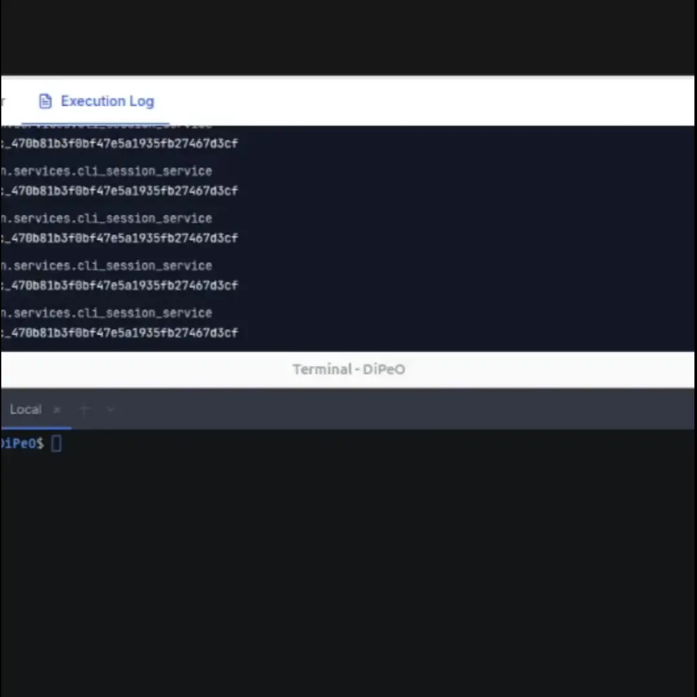

# DiPeO, Diagrammed People (agents) & Organizations (agent system)

> Start with `dipeo ask "the command you want to ask" --and-run`



* This will generate diagram and run it as you want to create.

### Why diagram?

* To show how it is **structured**, and how it works **in realtime**.
* For consistent outputs, rather than asking to code.

### Hmm, so can I tweak it?

<center></center>

* Definitely, you can just run `make dev-web` and tweak it in `localhost:3000`
* The whole procedure works inside your computer. Nothing is in cloud or somewhere in network.

### How about the diagram file?

* You can see the diagram file in `.yaml`

<details>
    <summary>The diagram file content we created looks like...</summary>

```yaml
    version: light
    name: data_processor_pipeline_dipeo
    description: A robust, reusable data processor pipeline from ingestion to output, including validation, transformation, routing,
      error handling, and observability.
    nodes:
    - label: ObjectiveInput
      type: start
      position:
        x: 0
        y: 0
      props:
        trigger_mode: manual
        custom_data:
          user_prompt: create data processor diagram
        output_data_structure:
          type: object
    - label: DefineDataConfig
      type: code_job
      position:
        x: 260
        y: 0
      props:
        language: python
        code: |
          import json
    
          # Sample, compact DataSource and DataSink artifacts (small, concrete examples)
          data_sources = [
              {"id": "source_csv_1", "type": "csv", "location": "./data/input.csv", "schema": {"fields": {"id": "int", "name": "str", "value": "float", "timestamp": "str"}}},
              {"id": "source_api_1", "type": "api", "endpoint": "https://api.example.com/data", "schema": {"fields": {"id": "int", "category": "str", "amount": "float", "ts": "str"}}},
              {"id": "source_kafka_1", "type": "kafka", "topic": "events", "bootstrap_servers": ["localhost:9092"], "schema": {"fields": {"id": "str", "payload": "dict"}}}
          ]
    
          data_sinks = [
              {"id": "sink_dw", "type": "parquet_store", "destination": "./warehouse/parquet/", "schema": {"fields": {"id": "int", "name": "str", "value": "float", "timestamp": "str"}}},
              {"id": "sink_blob", "type": "filesystem", "destination": "./lake/csv/", "schema": {"fields": {"id": "int", "name": "str", "value": "float", "timestamp": "str"}}}
          ]
    
          transformation_plan = {"steps": ["clean_nulls", "normalize_fields", "enrich_with_metadata", "deduplicate"]}
    
```

</details>

* For example, the diagram you generated with `dipeo ask ...` will be placed in `projects/dipeodipeo/generated`
* We support `.light.yaml` format which will format the diagram in readable format.

### How can I start?

* Install windows package if you're Windows user, or,

```bash
# clone github project first
make install
make graphql-schema  # Generate GraphQL types
make dev-all
```

### Ok. So is there a rule for diagram? Or, would you explain more detail?

* Yes, here is the documentary in detail.
  - [Full Documentation Index](docs/index.md) - Complete list of guides and technical documentation
  - [User Guide](docs/README.md) - Getting started with DiPeO diagram editor
  - We are developing some interesting projects using `dipeo` itself. Take a look at [projects](docs/projects)


> DiPeO(daɪpiːɔː) is a **monorepo** for building, executing, and monitoring AI‑powered agent workflows through an intuitive visual programming environment. The repository is composed of a feature-based React **frontend** (apps/web/), a domain-driven FastAPI **backend** (apps/server/), and a CLI **tool** (apps/cli/) that work together to deliver real‑time, multi‑LLM automation at scale.

## 핵심 기능

1. LLM과 작업 블록의 분리를 통한 직관적인 컨텍스트 관리
2. diagram의 yaml 형태 표현 및 실행 tool 제공
3. 다이어그램 엔드포인트를 활용한 A2A canvas 제공 (구현 예정)

For motivations, guide, details in Korean, read [Korean docs](docs/index.md)

### Code Generation (For Development)

If you need to modify the codebase or add new features:

```bash
# After modifying TypeScript specifications
cd dipeo/models && pnpm build  # Build TypeScript models
dipeo run codegen/diagrams/generate_all --light --debug --timeout=90  # Generate code
make apply-syntax-only  # Apply staged changes
make graphql-schema  # Update GraphQL types
```

## ollama supports
- Now we support ollama. All you have to do is add random api key to the file and write the diagram as:
```yaml
persons:
  person 1:
    service: ollama
    model: gpt-oss:20b
    api_key_id: APIKEY_21A814
```
read [example](files/diagrams/examples/simple_iter_ollama.light.yaml)

## Integrated API supports
- We support Notion, custom LLM with curl, ... etc, any API services


### `dipeo` - Run Diagrams with CLI

#### Run existing diagrams
```bash
# run diagram with automatically running server
dipeo run diagrams/examples/simple_iter --debug --light --timeout=10
# or, feed actual directory
dipeo run files/diagrams/examples/simple_iter.light.yaml --light --debug
```

#### Generate diagrams from natural language
```bash
# Generate a diagram from natural language request
dipeo ask --to "create csv preprocessor" --timeout=90

# Generate and immediately run the created diagram
dipeo ask --to "create csv preprocessor" --and-run --timeout=90

# With additional options
dipeo ask --to "build data pipeline" --and-run --debug --timeout=120 --run-timeout=300
```

**Note**: The `dipeo ask` command uses AI to generate DiPeO diagrams from your natural language description. Generation typically takes 150-250 seconds due to multiple LLM calls, even if it's using gpt-5-nano. Use `--timeout 120` for complex requests.

## Requirements
- Node.js 22+ with pnpm 10+
- Python 3.13+

### Release Notes
* **0.4.0:** Diagram generation with `dipeo ask` command