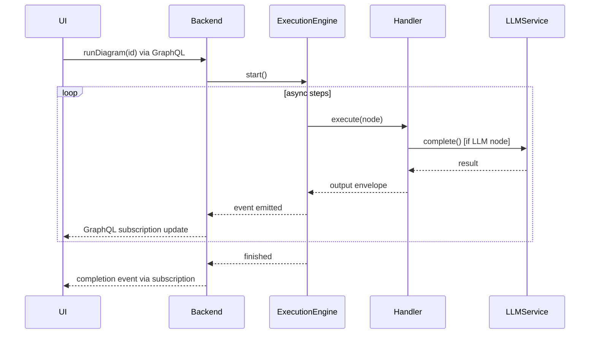

# DiPeO (Diagrammed People & Organizations) – 아키텍처 & 플로우


DiPeO는 개발자가 **멀티 에이전트 AI 워크플로를** 순수 코드 대신 다이어그램으로 **설계·실행·모니터링**할 수 있게 해주는 오픈 소스 플랫폼입니다.
리팩터 브랜치는 프로젝트를 단일 **모노레포**로 재구성하고, 더 단순한 컨테이너 기반 의존성 주입 시스템, 엔드투엔드 코드 생성 파이프라인, 에이전트 대화를 위한 더 풍부한 메모리 모델을 도입합니다.

---

## 1. 리포지토리 구조

| 경로                        | 설명                               | 특징                                                                                       |
| ------------------------- | -------------------------------- | ---------------------------------------------------------------------------------------- |
| **`apps/web`**            | React 19 비주얼 에디터                 | Vite, TailwindCSS, @xyflow/react 캔버스, Apollo + GraphQL, TRPC, TanStack Query, Zustand 상태 |
| **`apps/server`**         | FastAPI / Strawberry-GraphQL 백엔드 | Python 3.13, Hypercorn ASGI, 라이브 업데이트용 GraphQL 구독                                        |
| **`apps/cli`**            | 헤드리스 CLI 러너                      | `dipeo run diagram.yml`, 코드 생성 헬퍼                                                        |
| **`dipeo/`**              | 코어 도메인 + 애플리케이션 + 인프라 라이브러리      | 실행 엔진, DI 컨테이너, 어댑터, 코드 생성 출력                                                            |
| **`diagram_generated*/`** | 자동 생성 코드                         | Pydantic 모델, 노드 핸들러, GraphQL 스키마, TS 훅                                                   |

---

## 2. 상위 수준 아키텍처

| 레이어                      | 목적                         | 핵심 기술                                                                                                                      |
| ------------------------ | -------------------------- | -------------------------------------------------------------------------------------------------------------------------- |
| **프론트엔드**<br>`apps/web`  | 드래그앤드롭 다이어그램 에디터, 런 모니터    | *React 19*, Vite, @xyflow/react, Apollo Client + `graphql-ws`, TRPC, Zustand, TanStack Query, React-Hook-Form, TailwindCSS |
| **백엔드**<br>`apps/server` | GraphQL API 노출, 실행 오케스트레이션 | *Python 3.13*, FastAPI, Strawberry GraphQL, GraphQL 구독, Hypercorn, Pydantic v2                                             |
| **코어 라이브러리**<br>`dipeo/` | 도메인 모델, 실행 엔진, 메모리         | 이벤트 주도 아키텍처, 비동기 런타임, Pydantic, DI 서비스 레지스트리                                                                               |
| **CLI**<br>`apps/cli`    | 스크립트형 인터페이스, 코드 생성 드라이버    | `click` 스타일 UX, 순수 Python, `requests/pyyaml` 만 사용                                                                          |

---

## 3. 의존성 주입 컨테이너

```text
Top-level Container
├── CoreContainer            # 순수, 상태 없는 도메인 서비스
├── InfrastructureContainer  # 어댑터(LLM, 스토리지, …)
└── ApplicationContainer     # 오케스트레이터 & 유스케이스
```

* **CoreContainer** – 밸리데이터, 프롬프트 빌더, 템플릿 엔진, 공통 기능용 믹스인
* **InfrastructureContainer** – 스토리지 어댑터, LLM 어댑터, 통합 EventBus, 직접 서비스 구현
* **ApplicationContainer** – 컴파일 파이프라인, 다이어그램 컨버터, 대화 & 사람 매니저, **`ExecuteDiagramUseCase`**

세 컨테이너 모두 단일 **ServiceRegistry**를 공유하여 서비스 해석을 명시적이고 테스트 가능하게 만듭니다.

### 서비스 아키텍처 패턴

**믹스인 기반 서비스**: 서비스는 이제 단일 상속 대신 선택적 믹스인을 사용:
- `LoggingMixin` - 데코레이터를 사용한 구조화된 로깅
- `ValidationMixin` - 필드 및 타입 검증
- `ConfigurationMixin` - 설정 관리
- `CachingMixin` - TTL이 있는 인메모리 캐싱
- `InitializationMixin` - 초기화 추적

**직접 프로토콜 구현**: 불필요한 어댑터 레이어 제거:
- `EventBasedStateStore`가 상태 프로토콜을 직접 구현
- `PersonFactory`가 객체 생성 처리
- `CleanInMemoryPersonRepository`는 순수 지속성에 집중

---

## 4. 코드 생성 파이프라인

1. TypeScript 스펙(`*.spec.ts`)으로 노드를 **정의**합니다.
2. **생성** → 단계적 Pydantic 모델, JSON 스키마 & 노드 핸들러를 `/dipeo/diagram_generated_staged/`에 출력합니다.
3. `make apply`로 단계 코드를 **적용** → `/dipeo/diagram_generated/` (웹 & 백엔드가 함께 임포트)
4. **GraphQL 스키마** 내보내기(`make graphql-schema`).
5. 프론트엔드는 \*\*`pnpm codegen`\*\*을 실행하여 강타입 훅을 생성합니다.

> **새 노드 추가** → TS 스펙 작성 **+** Python 핸들러 작성 → `make codegen` 실행 → 모든 타입이 동기화 유지.

---

## 5. 메모리 & 대화 모델

* 모든 메시지는 **글로벌 불변 대화 로그**에 기록됩니다.
* 각 *사람*(LLM 인스턴스)은 `ALL_INVOLVED`, `SENT_BY_ME`, `CONVERSATION_PAIRS`, `ALL_MESSAGES` 같은 **필터**와 슬라이딩 윈도우 제한을 결합하여 그 로그를 봅니다.
* 잡마다 **메모리 프로필**(`GOLDFISH`, `MINIMAL`, `FOCUSED`, `FULL`) 또는 커스텀 설정을 구성할 수 있어 다음 패턴을 지원합니다:

  * **토론(Debates)** – 심판은 `FULL`, 토론자는 제한된 컨텍스트의 `FOCUSED`.
  * **파이프라인** – 다운스트림으로 갈수록 컨텍스트를 점차 축소(`FULL` → `FOCUSED` → `MINIMAL`).
  * **GOLDFISH** – 실행 간 완전 메모리 리셋으로 무상태 에이전트 구현.

---

## 6. 노드 핸들러 시스템

DiPeO는 다양한 노드 타입을 실행하기 위해 타입-세이프한 핸들러 기반 아키텍처를 사용합니다.

### 핸들러 구성

```text
dipeo/application/execution/handlers/
├── __init__.py              # 자동 등록 임포트
├── auto_register.py         # 동적 핸들러 디스커버리
├── base.py                  # TypedNodeHandler 프로토콜
├── simple handlers/         # 단일 파일 핸들러
│   ├── start.py
│   ├── endpoint.py
│   └── condition.py
└── complex handlers/        # 패키지 기반 핸들러
    ├── person_job/
    │   ├── __init__.py      # 메인 핸들러
    │   └── single_executor.py
    └── code_job/
        ├── __init__.py      # 메인 핸들러
        └── executors/       # 언어별 실행기
            ├── python_executor.py
            └── typescript_executor.py
```

### 핸들러 인터페이스

모든 핸들러는 `TypedNodeHandler` 프로토콜을 구현합니다:

```python
@register_handler
class PersonJobNodeHandler(TypedNodeHandler[PersonJobNode]):
    def prepare_inputs(self, inputs: dict, request: ExecutionRequest) -> dict
        # 원시 입력을 핸들러 전용 형식으로 변환
    
    async def run(self, inputs: dict, request: ExecutionRequest) -> Any
        # 노드 비즈니스 로직 실행
    
    def serialize_output(self, result: Any, request: ExecutionRequest) -> Envelope
        # 결과를 표준화된 Envelope 형식으로 변환
    
    async def on_error(self, request: ExecutionRequest, error: Exception) -> Optional[Envelope]
        # 에러를 우아하게 처리
    
    def post_execute(self, request: ExecutionRequest, output: Envelope) -> Envelope
        # 사후 처리 훅(로깅, 메트릭 등)
```

### 자동 등록

핸들러는 시작 시 자동으로 디스커버리되어 등록됩니다:

* `@register_handler` 데코레이터로 핸들러 클래스를 표시
* `auto_register.py`가 핸들러 디렉터리를 스캔
* 수동 등록 불필요 — 파일만 추가하면 됨
* 단일 파일/패키지형 핸들러 모두 지원

### 핸들러 실행 흐름

1. **TypedExecutionEngine**이 실행 준비가 된 노드를 판정
2. **RuntimeResolver**가 상류 노드의 입력(Envelope)을 해석
3. 핸들러의 `prepare_inputs()`가 Envelope 입력을 요구 형식으로 변환
4. 핸들러의 `run()`이 노드 로직을 실행(필요 시 인프라 서비스에 위임)
5. `serialize_output()`이 결과를 Envelope로 래핑
6. **AsyncEventBus**가 `NODE_COMPLETED` 이벤트 발행
7. 출력 Envelope이 하류 노드에서 사용 가능해짐

### 엔벌로프(Envelope) 시스템

엔벌로프는 노드 간에 흐르는 타입화된 데이터 컨테이너입니다:

* **구조**: `{body, content_type, produced_by, trace_id, metadata}`
* **콘텐츠 타입**: `raw_text`, `object`(JSON), `conversation_state`, `error`
* **목적**: 출처 추적이 가능한 타입-세이프 데이터 전달
* **팩토리**: `EnvelopeFactory.create()` 자동 감지 (`.text()`, `.json()`, `.error()` 메서드는 폐기됨)

### 주요 핸들러 예시

* **PersonJobHandler**: LLM 대화를 관리하고 인프라 LLM 서비스에 위임
* **CodeJobHandler**: 언어별 실행기를 통해 다양한 언어 코드를 실행
* **ConditionHandler**: 표현식을 평가하고 실행 흐름을 라우팅
* **DBHandler**: 데이터베이스 읽기/쓰기 수행
* **TemplateJobHandler**: 커스텀 필터가 있는 Jinja2 템플릿 렌더링

### 관심사 분리

핸들러는 클린 아키텍처 원칙을 따릅니다:

* **도메인 로직**은 도메인 레이어에 머뭅니다(대화 관리, 메모리)
* **인프라 관심사**는 서비스에 위임합니다(LLM API, 파일 I/O, 외부 API)
* **애플리케이션 레이어**는 도메인과 인프라 사이를 오케스트레이션
* 핸들러는 외부 서비스를 직접 호출하지 않고 **항상 주입된 의존성**을 통해 접근

---

## 7. 실행 플로우(요약)



---

## 8. 기술 스택 치트시트

| 영역           | 도구 / 라이브러리                                                                                           |
| ------------ | ---------------------------------------------------------------------------------------------------- |
| **언어**       | TypeScript 5 (pnpm + Vite) • Python 3.13                                                             |
| **프론트엔드**    | React 19, @xyflow/react, Apollo Client, GraphQL-WS, TRPC, TanStack Query, Zustand, TailwindCSS, Zod  |
| **백엔드**      | FastAPI, Strawberry GraphQL, Hypercorn, Pydantic v2, Tenacity(재시도), AsyncEventBus, Redis(멀티 워커 시 선택) |
| **DI / IoC** | 커스텀 서비스-레지스트리 패턴(코어 / 인프라 / 앱 컨테이너)                                                                  |
| **LLM 어댑터**  | OpenAI, Anthropic, Gemini(확장 가능)                                                                     |
| **툴링**       | Ruff, Mypy, Makefile 헬퍼                                                                              |
| **CI / 테스트** | Pytest, Vitest, GitHub Actions(린트, 타입체크, e2e)                                                        |

---

## 9. 실행 & 배포

### 로컬 개발

```bash
# 1회 설정
make install          # Python & Node 의존성
# 모두 실행(백엔드 :8000, 프론트엔드 :3000)
make dev-all
```

> 핫 리로드: Vite는 UI를 자동 리로드합니다. 백엔드 변경 시 Hypercorn은 수동 재시작 필요.

### 프로덕션

* SPA 빌드: `pnpm build` → CDN으로 서빙하거나 FastAPI 아래에 마운트
* API 서빙: `hypercorn apps/server.main:app -w 4 -k uvloop` (또는 Uvicorn/Gunicorn)
* 멀티 워커 배포에서는 GraphQL 구독을 워커 간에 동기화하려면 Redis가 필요
* 컨테이너 이미지 & Helm 차트는 `/deploy/`에 제공

### 데스크톱 애플리케이션

독립 실행형 Windows 설치본의 경우, 서버와 웹 컴포넌트를 PyInstaller로 `.exe`로 만든 뒤, 설치 관리자(NSIS)가 이 실행 파일들을 번들링합니다.

---

## 10. 이벤트 기반 아키텍처

시스템은 실행과 모니터링을 위해 완전한 이벤트 기반 아키텍처를 사용합니다:

* **통합 EventBus 프로토콜** – DomainEventBus, EventEmitter, EventConsumer, MessageBus를 단일 인터페이스로 통합
* **EventBasedStateStore** – 실행별 캐시를 가진 락-프리 상태 영속화, 프로토콜을 직접 구현(어댑터 레이어 없음)
* **GraphQL Subscriptions** – UI에 실시간 업데이트(SSE 대체)
* **글로벌 락 없음** – 실행별 격리로 진정한 병렬 실행
* **이벤트 타입** – TypeScript 사양에서 생성된 표준화된 이벤트
* **하위 호환성** – 마이그레이션 중 래퍼 클래스를 통한 레거시 인터페이스 지원

이 아키텍처는 다음을 가능케 합니다:

* 모니터링의 제로 영향(발사 후 망각 이벤트)
* 경합 없는 진정한 병렬 실행
* 이벤트 디커플링을 통한 관심사 명확 분리
* 비동기 상태 영속화
* 통합 프로토콜을 통한 단순화된 서비스 등록
