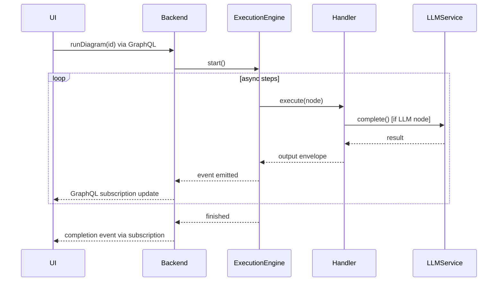

# DiPeO (Diagrammed People & Organizations) – Architecture & Flow


DiPeO is an open-source platform that lets developers **design, run and monitor multi-agent AI workflows** as diagrams instead of raw code. The project is organized as a **monorepo** with container-based dependency injection, end-to-end code generation, and a sophisticated memory model for agent conversations.

---

## 1. Repository layout

| Path                      | What it is                                         | Highlights                                                                              |
| ------------------------- | -------------------------------------------------- | --------------------------------------------------------------------------------------- |
| **`apps/web`**            | React 19 visual editor                             | Vite, TailwindCSS, @xyflow/react canvas, Apollo + GraphQL, TRPC, TanStack Query, Zustand state |
| **`apps/server`**         | FastAPI / Strawberry-GraphQL backend               | Python 3.13, Hypercorn ASGI, GraphQL subscriptions for live updates                     |
| **`apps/cli`**            | Headless CLI runner                                | `dipeo run diagram.yml`, code-gen helpers                                               |
| **`dipeo/`**              | Core domain + application + infrastructure library | Execution engine, DI containers, adapters, code-gen output                              |
| **`diagram_generated*/`** | Auto-generated code                                | Pydantic models, node handlers, GraphQL schema, TS hooks                                |

---

## 2. High-level architecture

| Layer                        | Purpose                                      | Key tech                                                                                                            |
| ---------------------------- | -------------------------------------------- | ------------------------------------------------------------------------------------------------------------------- |
| **Front-end**<br>`apps/web`  | Drag-and-drop diagram editor, run monitor    | *React 19*, Vite, @xyflow/react, Apollo Client + `graphql-ws`, TRPC, Zustand, TanStack Query, React-Hook-Form, TailwindCSS |
| **Backend**<br>`apps/server` | Exposes GraphQL API, orchestrates runs       | *Python 3.13*, FastAPI, Strawberry GraphQL, GraphQL subscriptions, Hypercorn, Pydantic v2                          |
| **Core library**<br>`dipeo/` | Domain models, execution engine, memory      | Event-driven architecture, async runtime, Pydantic, DI service registry                                             |
| **CLI**<br>`apps/cli`        | Scriptable interface, code-gen driver        | `click`-style UX, pure Python, `requests/pyyaml` only                                                               |

---

## 3. Dependency-injection containers

```text
Top-level Container
├── CoreContainer            # Pure, stateless domain services
├── InfrastructureContainer  # Adapters (LLM, storage, …)
└── ApplicationContainer     # Orchestrators & use-cases
```

* **CoreContainer** – validator, prompt builder, template engine, mixins for common functionality
* **InfrastructureContainer** – storage adapter, LLM adapter, unified EventBus, direct service implementations
* **ApplicationContainer** – compilation pipeline, diagram converter, conversation & person managers, **`ExecuteDiagramUseCase`**

All three share a single **ServiceRegistry**, making service resolution explicit and testable.

### Service Architecture Patterns

**Mixin-based Services**: Services now use optional mixins instead of monolithic inheritance:
- `LoggingMixin` - structured logging with decorators
- `ValidationMixin` - field and type validation
- `ConfigurationMixin` - configuration management
- `CachingMixin` - in-memory caching with TTL
- `InitializationMixin` - initialization tracking

**Direct Protocol Implementation**: Eliminated unnecessary adapter layers:
- `CacheFirstStateStore` directly implements state protocols with cache-first optimization
- `PersonFactory` handles object construction
- `CleanInMemoryPersonRepository` focuses purely on persistence

---

## 4. Code-generation pipeline

1. **Define** nodes in TypeScript specs (`*.spec.ts`).
2. **Generate** → staged Pydantic models, JSON schemas & node handlers (`/dipeo/diagram_generated_staged/`).
3. **Apply** staged code with `make apply` → `/dipeo/diagram_generated/` (imported by both web & backend).
4. **Export** GraphQL schema (`make graphql-schema`).
5. **Frontend** runs `pnpm codegen` to produce strongly-typed hooks.

> **Add a new node** → write a TS spec **+** Python handler → run `make codegen` → everything stays in sync.

---

## 5. Memory & conversation model

* Every message goes into a **global, immutable conversation log**.
* Each *person* (LLM instance) views that log through **filters** such as `ALL_INVOLVED`, `SENT_BY_ME`, `CONVERSATION_PAIRS`, `ALL_MESSAGES`, combined with sliding-window limits.
* Memory is configured per job using **Memory Profiles** (`GOLDFISH`, `MINIMAL`, `FOCUSED`, `FULL`) or custom settings, enabling patterns like:

  * **Debates** – judges use `FULL` profile, debaters use `FOCUSED` profile for limited context.
  * **Pipelines** – context gradually shrinks along downstream tasks (from `FULL` → `FOCUSED` → `MINIMAL`).
  * **GOLDFISH** – Complete memory reset between executions for stateless agents.

---

## 6. Node Handler System

DiPeO uses a type-safe, handler-based architecture for executing different node types:

### Handler Organization

```text
dipeo/application/execution/handlers/
├── __init__.py              # Auto-registration imports
├── auto_register.py         # Dynamic handler discovery
├── base.py                  # TypedNodeHandler protocol
├── simple handlers/         # Single-file handlers
│   ├── start.py
│   ├── endpoint.py
│   └── condition.py
└── complex handlers/        # Package-based handlers
    ├── person_job/
    │   ├── __init__.py      # Main handler
    │   └── single_executor.py
    └── code_job/
        ├── __init__.py      # Main handler
        └── executors/       # Language-specific executors
            ├── python_executor.py
            └── typescript_executor.py
```

### Handler Interface

All handlers implement the `TypedNodeHandler` protocol:

```python
@register_handler
class PersonJobNodeHandler(TypedNodeHandler[PersonJobNode]):
    def prepare_inputs(self, inputs: dict, request: ExecutionRequest) -> dict
        # Transform raw inputs into handler-specific format
    
    async def run(self, inputs: dict, request: ExecutionRequest) -> Any
        # Execute the node's business logic
    
    def serialize_output(self, result: Any, request: ExecutionRequest) -> Envelope
        # Convert result to standardized Envelope format
    
    async def on_error(self, request: ExecutionRequest, error: Exception) -> Optional[Envelope]
        # Handle errors gracefully
    
    def post_execute(self, request: ExecutionRequest, output: Envelope) -> Envelope
        # Post-processing hook (logging, metrics, etc.)
```

### Auto-Registration

Handlers are automatically discovered and registered at startup:
- `@register_handler` decorator marks handler classes
- `auto_register.py` scans the handlers directory
- No manual registration needed - just add new handler files
- Supports both single-file handlers and handler packages

### Handler Execution Flow

1. **TypedExecutionEngine** determines which nodes are ready to execute
2. **RuntimeResolver** resolves inputs from upstream nodes (as Envelopes)
3. Handler's `prepare_inputs()` transforms Envelope inputs into required format
4. Handler's `run()` executes the node logic (may delegate to infrastructure services)
5. Handler's `serialize_output()` wraps result in an Envelope
6. **AsyncEventBus** emits NODE_COMPLETED event
7. Output Envelope becomes available for downstream nodes

### Envelope System

Envelopes are typed data containers that flow between nodes:
- **Structure**: `{body, content_type, produced_by, trace_id, metadata}`
- **Content Types**: `raw_text`, `object` (JSON), `conversation_state`, `error`
- **Purpose**: Type-safe data passing with provenance tracking
- **Factory**: `EnvelopeFactory.create()` with auto-detection (deprecates `.text()`, `.json()`, `.error()` methods)
- **Migration Complete**: All NodeOutput references migrated to Envelope pattern (`SerializedNodeOutput` is now an alias for `SerializedEnvelope`)

### Key Handler Examples

- **PersonJobHandler**: Manages LLM conversations, delegates to infrastructure LLM service
- **CodeJobHandler**: Executes code in different languages via language-specific executors
- **ConditionHandler**: Evaluates expressions and routes execution flow
- **DBHandler**: Performs database operations (read/write)
- **TemplateJobHandler**: Renders Jinja2 templates with custom filters

### Separation of Concerns

Handlers follow clean architecture principles:
- **Domain logic** stays in the domain layer (conversation management, memory)
- **Infrastructure concerns** delegated to services (LLM APIs, file I/O, external APIs)
- **Application layer** orchestrates between domain and infrastructure
- Handlers never directly call external services - always through injected dependencies

## 7. Execution flow (simplified)



---

## 8. Tech-stack cheat-sheet

| Area             | Tools / libs                                                                                                               |
| ---------------- | -------------------------------------------------------------------------------------------------------------------------- |
| **Languages**    | TypeScript 5 (pnpm + Vite) • Python 3.13                                                                                   |
| **Front-end**    | React 19, @xyflow/react, Apollo Client, GraphQL-WS, TRPC, TanStack Query, Zustand, TailwindCSS, Zod                        |
| **Back-end**     | FastAPI, Strawberry GraphQL, Hypercorn, Pydantic v2, Tenacity (retry), Unified EventBus, Redis (optional for multi-worker)   |
| **DI / IoC**     | Custom service-registry pattern with mixin-based services and direct protocol implementations                                                            |
| **LLM adapters** | OpenAI, Anthropic, Gemini (extensible)                                                                                     |
| **Tooling**      | Ruff, Mypy, Makefile helpers, Pre-commit hooks                                                                                               |
| **CI / tests**   | Pytest, Vitest, GitHub Actions (lint, type-check, e2e), Enhanced type safety with gradual mypy adoption                                                                     |
| **Code Gen**     | TypeScript-to-Python generation with snake_case naming and Pydantic aliases for compatibility                                     |

---

## 9. Running & deploying

### Local development

```bash
# one-time setup
make install          # Python & Node deps
# start everything (backend :8000, frontend :3000)
make dev-all
```

> Hot-reload: Vite auto-reloads the UI; restart Hypercorn manually for backend changes.

### Production

* Build SPA: `pnpm build` → serve via CDN or mount under FastAPI.
* Serve API: `hypercorn apps/server.main:app -w 4 -k uvloop` (or Uvicorn/Gunicorn).
* For multi-worker deployments, Redis is required for GraphQL subscriptions to work across workers.
* Container images & Helm charts are provided in `/deploy/`.

### Desktop Application

For standalone Windows installations, use PyInstaller to create `.exe` files from the server and web components. The installer (NSIS) bundles these executables for distribution.

---

## 10. Event-Driven Architecture

The system uses a fully event-driven architecture for execution and monitoring:

* **Unified EventBus Protocol** – Consolidates DomainEventBus, EventEmitter, EventConsumer, and MessageBus into a single interface
* **CacheFirstStateStore** – Cache-first state persistence with Phase 4 optimizations, implements protocol directly (no adapter layer)
* **GraphQL Subscriptions** – Real-time updates to UI (replaced SSE)
* **No Global Locks** – Per-execution isolation enables true parallel execution
* **Event Types** – Standardized events generated from TypeScript specifications
* **Backward Compatibility** – Legacy interfaces available through wrapper classes during migration

This architecture enables:
- Zero-impact monitoring (fire-and-forget events)
- True parallel execution without contention
- Clean separation of concerns via event decoupling
- Asynchronous state persistence
- Simplified service registration with unified protocols

---

## 11. GraphQL Layer Architecture

### GraphQL Architecture

The GraphQL layer provides a production-ready architecture:

- **45 operations** with full GraphQL query strings as constants (23 queries, 21 mutations, 1 subscription)
- **Type-safe operation classes** with proper TypedDict for variables and automatic Strawberry input conversion
- **Well-structured resolver implementations** following consistent patterns with ServiceRegistry dependency injection
- **Clean 3-tier architecture** separating generated code, application logic, and execution layer
- **Comprehensive type safety** throughout the entire stack

### Architecture Overview

The GraphQL layer uses a clean 3-tier architecture:

```
┌─────────────────────────────────────────────────────────────────┐
│                        Generated Layer                         │
│  /dipeo/diagram_generated/graphql/ (Automated from TypeScript) │
├─────────────────────────────────────────────────────────────────┤
│                      Application Layer                         │
│  /dipeo/application/graphql/ (Manual Business Logic)           │
├─────────────────────────────────────────────────────────────────┤
│                      Execution Layer                           │
│  OperationExecutor (Runtime mapping and validation)            │
└─────────────────────────────────────────────────────────────────┘
```

### Key Components

- **Generated Layer**: `/dipeo/diagram_generated/graphql/operations.py` - All 45 operations with complete GraphQL query strings and typed operation classes
- **Application Layer**: `/dipeo/application/graphql/` - Resolver implementations following consistent patterns with ServiceRegistry integration
- **Execution Layer**: `OperationExecutor` - Type-safe mapping between operations and resolvers with validation

### Integration Benefits

- **Event System**: GraphQL subscriptions use the unified EventBus for real-time updates
- **Envelope System**: All resolvers work with DiPeO's standardized Envelope data flow
- **Service Registry**: Clean dependency injection throughout all GraphQL resolvers
- **Type Safety**: Full TypeScript-to-Python type safety across the entire stack

For detailed documentation, see [GraphQL Layer Architecture](graphql-layer.md).
