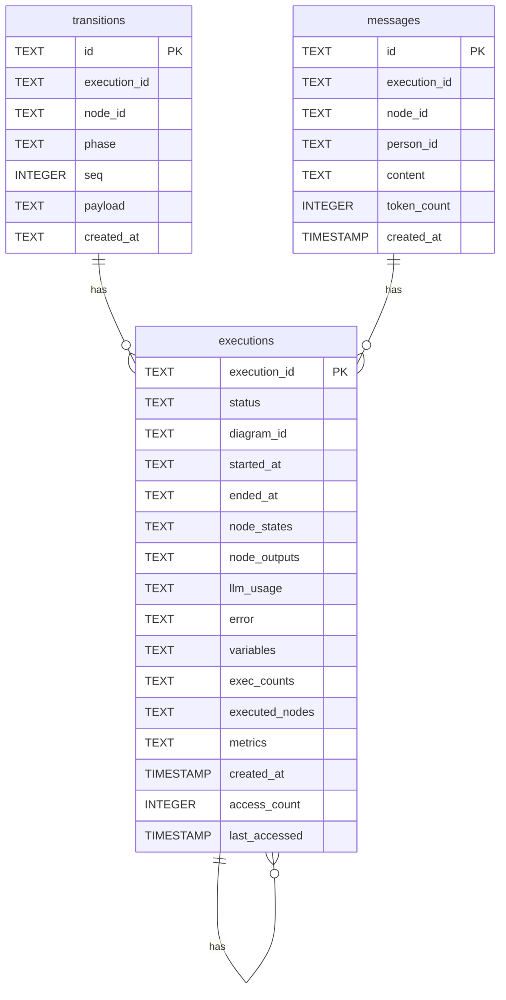

# DiPeO Database Schema Documentation

> **Auto-generated documentation** - DO NOT EDIT MANUALLY
> Generated from SQL CREATE TABLE statements in Python source code
> Run `make schema-docs` to regenerate

## Overview

DiPeO uses SQLite databases for persistence with the following schema:

- **Number of tables**: 3
- **Database location**: `.dipeo/data/dipeo_state.db`

## Tables

### `executions`

**Source**: `dipeo/infrastructure/execution/state/persistence_manager.py`

**Primary Key**: `execution_id`

#### Columns

| Column | Type | Constraints |
|--------|------|-------------|
| `execution_id` | `TEXT` | PRIMARY KEY |
| `status` | `TEXT` | NOT NULL |
| `diagram_id` | `TEXT` | - |
| `started_at` | `TEXT` | NOT NULL |
| `ended_at` | `TEXT` | - |
| `node_states` | `TEXT` | NOT NULL |
| `node_outputs` | `TEXT` | NOT NULL |
| `llm_usage` | `TEXT` | NOT NULL |
| `error` | `TEXT` | - |
| `variables` | `TEXT` | NOT NULL |
| `exec_counts` | `TEXT` | NOT NULL DEFAULT '{}' |
| `executed_nodes` | `TEXT` | NOT NULL DEFAULT '[]' |
| `metrics` | `TEXT` | DEFAULT NULL |
| `created_at` | `TIMESTAMP` | DEFAULT CURRENT_TIMESTAMP |
| `access_count` | `INTEGER` | DEFAULT 0 |
| `last_accessed` | `TIMESTAMP` | DEFAULT CURRENT_TIMESTAMP |

#### Indexes

- **idx_status**: INDEX idx_status ON (status)
- **idx_started_at**: INDEX idx_started_at ON (started_at)
- **idx_diagram_id**: INDEX idx_diagram_id ON (diagram_id)
- **idx_access_count**: INDEX idx_access_count ON (access_count DESC)
- **idx_last_accessed**: INDEX idx_last_accessed ON (last_accessed DESC)

### `messages`

**Source**: `apps/server/src/dipeo_server/infra/message_store.py`

**Primary Key**: `id`

#### Columns

| Column | Type | Constraints |
|--------|------|-------------|
| `id` | `TEXT` | PRIMARY KEY |
| `execution_id` | `TEXT` | NOT NULL |
| `node_id` | `TEXT` | NOT NULL |
| `person_id` | `TEXT` | - |
| `content` | `TEXT` | NOT NULL |
| `token_count` | `INTEGER` | - |
| `created_at` | `TIMESTAMP` | DEFAULT CURRENT_TIMESTAMP |

#### Indexes

- **idx_execution**: INDEX idx_execution ON (execution_id)
- **idx_node**: INDEX idx_node ON (node_id)

### `transitions`

**Source**: `dipeo/infrastructure/execution/state/persistence_manager.py`

**Primary Key**: `id`

#### Columns

| Column | Type | Constraints |
|--------|------|-------------|
| `id` | `TEXT` | PRIMARY KEY |
| `execution_id` | `TEXT` | NOT NULL |
| `node_id` | `TEXT` | - |
| `phase` | `TEXT` | NOT NULL |
| `seq` | `INTEGER` | NOT NULL |
| `payload` | `TEXT` | NOT NULL |
| `created_at` | `TEXT` | NOT NULL DEFAULT (datetime('now')) |

#### Indexes

- **ux_exec_seq**: UNIQUE INDEX ux_exec_seq ON (execution_id, seq)
- **idx_exec_transitions**: INDEX idx_exec_transitions ON (execution_id)
- **idx_created_at**: INDEX idx_created_at ON (created_at DESC)

## Mermaid ER Diagram

