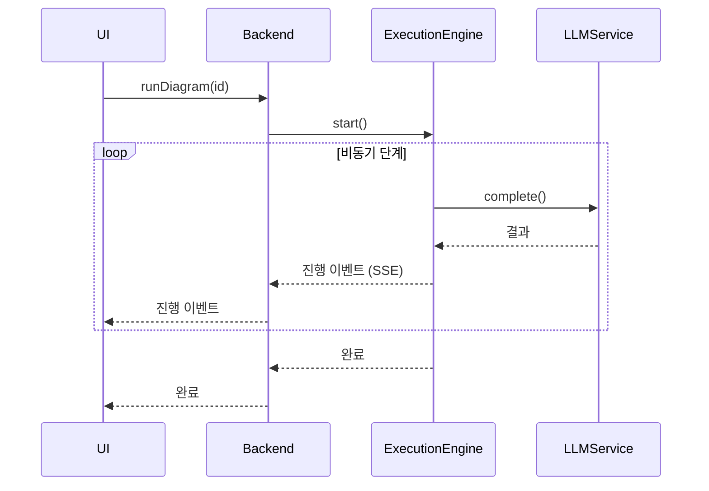

# DiPeO (Diagrammed People & Organizations) – 아키텍처 및 플로우

*(리팩터 브랜치)*

DiPeO는 개발자들이 **멀티 에이전트 AI 워크플로우를 코드 대신 다이어그램으로 설계, 실행 및 모니터링**할 수 있게 해주는 오픈소스 플랫폼입니다.
리팩터 브랜치는 프로젝트를 단일 **모노레포**로 재구성하고, 더 간단한 컨테이너 기반 의존성 주입 시스템, 엔드투엔드 코드 생성 파이프라인, 그리고 에이전트 대화를 위한 더 풍부한 메모리 모델을 도입합니다.

---

## 1. 저장소 레이아웃

| 경로                      | 설명                                               | 주요 특징                                                                               |
| ------------------------- | -------------------------------------------------- | --------------------------------------------------------------------------------------- |
| **`apps/web`**            | React 19 비주얼 에디터                             | Vite, TailwindCSS, XYFlow 캔버스, Apollo + GraphQL, TRPC, TanStack Query, Zustand 상태 |
| **`apps/server`**         | FastAPI / Strawberry-GraphQL 백엔드               | Python 3.13, Hypercorn ASGI, 실시간 업데이트를 위한 Server-Sent Events (SSE)          |
| **`apps/cli`**            | 헤드리스 CLI 러너                                  | `dipeo run diagram.yml`, 코드 생성 헬퍼                                                |
| **`dipeo/`**              | 코어 도메인 + 애플리케이션 + 인프라 라이브러리     | 실행 엔진, DI 컨테이너, 어댑터, 코드 생성 출력                                         |
| **`diagram_generated*/`** | 자동 생성 코드                                     | Pydantic 모델, 노드 핸들러, GraphQL 스키마, TS 훅                                      |

---

## 2. 고수준 아키텍처

| 레이어                       | 목적                                      | 주요 기술                                                                                                           |
| ---------------------------- | ----------------------------------------- | ------------------------------------------------------------------------------------------------------------------- |
| **프론트엔드**<br>`apps/web` | 드래그 앤 드롭 다이어그램 편집기, 실행 모니터 | *React 19*, Vite, XYFlow, Apollo Client + `graphql-ws`, TRPC, Zustand, TanStack Query, React-Hook-Form, TailwindCSS |
| **백엔드**<br>`apps/server`  | GraphQL & SSE API 제공, 실행 오케스트레이션   | *Python 3.13*, FastAPI, Strawberry GraphQL, **sse-starlette**, Hypercorn, Pydantic v2                               |
| **코어 라이브러리**<br>`dipeo/` | 도메인 모델, 실행 엔진, 메모리              | 클린 아키텍처, 비동기 런타임, Pydantic, DI 서비스 레지스트리                                                        |
| **CLI**<br>`apps/cli`        | 스크립트 가능한 인터페이스, 코드 생성 드라이버 | `click` 스타일 UX, 순수 Python, `requests/pyyaml`만 사용                                                            |

---

## 3. 의존성 주입 컨테이너

```text
최상위 컨테이너
├── CoreContainer            # 순수하고 상태가 없는 도메인 서비스
├── InfrastructureContainer  # 어댑터 (LLM, 스토리지, …)
└── ApplicationContainer     # 오케스트레이터 및 유스케이스
```

* **CoreContainer** – 검증기, 프롬프트 빌더, 템플릿 엔진
* **InfrastructureContainer** – 스토리지 어댑터, LLM 어댑터 (도메인 LLM 서비스를 감싸고, API 키 서비스에서 키를 가져옴), 선택적 Notion / AST 어댑터 (기본값 `None`)
* **ApplicationContainer** – 컴파일 파이프라인, 다이어그램 컨버터, 대화 및 사람 관리자, **`ExecuteDiagramUseCase`**

세 컨테이너 모두 단일 **ServiceRegistry**를 공유하여 서비스 해결을 명시적이고 테스트 가능하게 만듭니다.

---

## 4. 코드 생성 파이프라인

1. TypeScript 스펙으로 노드 **정의** (`*.spec.ts`)
2. **생성** → 스테이징된 Pydantic 모델, JSON 스키마 및 노드 핸들러 (`/dipeo/diagram_generated_staged/`)
3. `make apply`로 스테이징된 코드 **적용** → `/dipeo/diagram_generated/` (웹과 백엔드 모두에서 import)
4. GraphQL 스키마 **내보내기** (`make graphql-schema`)
5. **프론트엔드**에서 `pnpm codegen` 실행하여 강타입 훅 생성

> **새 노드 추가** → TS 스펙 **+** Python 핸들러 작성 → `make codegen` 실행 → 모든 것이 동기화됨

---

## 5. 메모리 및 대화 모델

* 모든 메시지는 **전역적이고 불변인 대화 로그**에 저장됩니다.
* 각 *사람*(LLM 인스턴스)은 `ALL_INVOLVED`, `SENT_BY_ME`, `CONVERSATION_PAIRS` 같은 **필터**와 슬라이딩 윈도우 제한을 통해 해당 로그를 봅니다.
* 메모리 크기와 필터는 **작업별로 구성**되어 다음과 같은 패턴을 가능하게 합니다:

  * **토론** – 심판은 모든 것을 보고, 토론자는 쌍별 턴만 봄
  * **파이프라인** – 다운스트림 작업을 따라 컨텍스트가 점진적으로 축소됨

---

## 6. 실행 플로우 (단순화)



---

## 7. 기술 스택 치트시트

| 영역             | 도구 / 라이브러리                                                                                                      |
| ---------------- | ---------------------------------------------------------------------------------------------------------------------- |
| **언어**         | TypeScript 5 (pnpm + Vite) • Python 3.13                                                                               |
| **프론트엔드**   | React 19, XYFlow, Apollo Client, GraphQL-WS, TRPC, TanStack Query, Zustand, TailwindCSS, Zod                           |
| **백엔드**       | FastAPI, Strawberry GraphQL, Hypercorn, **sse-starlette**, Pydantic v2, Tenacity (재시도), Redis (pub-sub용 선택사항) |
| **DI / IoC**     | 커스텀 서비스 레지스트리 패턴 (core / infra / app 컨테이너)                                                            |
| **LLM 어댑터**   | OpenAI, Anthropic, Gemini (확장 가능)                                                                                  |
| **도구**         | Ruff, Mypy, Makefile 헬퍼                                                                                              |
| **CI / 테스트**  | Pytest, Vitest, GitHub Actions (린트, 타입 체크, e2e)                                                                   |

---

## 8. 실행 및 배포

### 로컬 개발

```bash
# 일회성 설정
make install          # Python & Node 의존성
# 모든 것 시작 (백엔드 :8000, 프론트엔드 :3000)
make dev-all
```

> 핫 리로드: Vite가 UI를 자동으로 리로드; 백엔드 변경사항은 Hypercorn을 수동으로 재시작

### 프로덕션

* SPA 빌드: `pnpm build` → CDN을 통해 서비스하거나 FastAPI 아래에 마운트
* API 서비스: `hypercorn apps/server.main:app -w 4 -k uvloop` (또는 Uvicorn/Gunicorn)
* 대규모 GraphQL 구독을 위해 **Redis** 브로드캐스트 활성화
* 컨테이너 이미지와 Helm 차트는 `/deploy/`에 제공됨

### 데스크톱 애플리케이션

독립 실행형 Windows 설치를 위해 PyInstaller를 사용하여 서버 및 웹 구성 요소에서 `.exe` 파일을 생성합니다. 설치 프로그램(NSIS)은 이러한 실행 파일을 배포용으로 번들링합니다.

---

## 9. 리팩터가 중요한 이유 🌟

* **단일 서비스 레지스트리** → 숨겨진 전역 변수 없음, 더 쉬운 테스트
* **통합 코드 생성** → TS와 Python 간 타입의 단일 진실 소스
* **메모리 필터** → 에이전트별 사일로 없이 유연한 멀티 에이전트 패턴
* **3개 컨테이너 DI** → 도메인 로직을 건드리지 않고 인프라(LLM, 스토리지) 교체 가능
* **모노레포 규율** → 웹, 서버, CLI 간 원자적 변경

---

> **다음 단계**
> *생성된 코드에 대한 CI 린트 규칙 구현, 높은 동시성 하에서 새 실행 엔진 벤치마크, 메모리 필터 모범 사례 문서화*

---