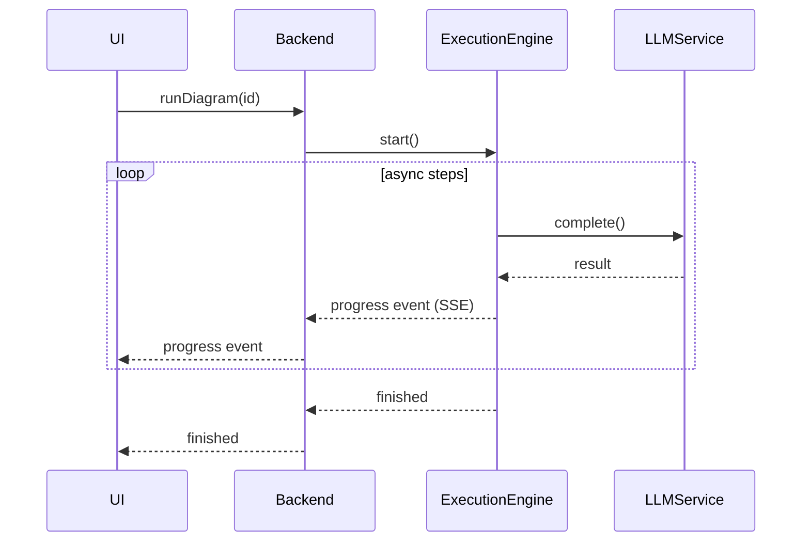

# DiPeO (Diagrammed People & Organizations) – Architecture & Flow

*(Refactor branch)*

DiPeO is an open-source platform that lets developers **design, run and monitor multi-agent AI workflows** as diagrams instead of raw code.
The refactor branch reorganises the project into a single **monorepo** and introduces a simpler, container-based dependency-injection system, an end-to-end code-generation pipeline, and a richer memory model for agent conversations.

---

## 1. Repository layout

| Path                      | What it is                                         | Highlights                                                                              |
| ------------------------- | -------------------------------------------------- | --------------------------------------------------------------------------------------- |
| **`apps/web`**            | React 19 visual editor                             | Vite, TailwindCSS, XYFlow canvas, Apollo + GraphQL, TRPC, TanStack Query, Zustand state |
| **`apps/server`**         | FastAPI / Strawberry-GraphQL backend               | Python 3.13, Hypercorn ASGI, Server-Sent Events (SSE) for live updates                  |
| **`apps/cli`**            | Headless CLI runner                                | `dipeo run diagram.yml`, code-gen helpers                                               |
| **`dipeo/`**              | Core domain + application + infrastructure library | Execution engine, DI containers, adapters, code-gen output                              |
| **`diagram_generated*/`** | Auto-generated code                                | Pydantic models, node handlers, GraphQL schema, TS hooks                                |

---

## 2. High-level architecture

| Layer                        | Purpose                                      | Key tech                                                                                                            |
| ---------------------------- | -------------------------------------------- | ------------------------------------------------------------------------------------------------------------------- |
| **Front-end**<br>`apps/web`  | Drag-and-drop diagram editor, run monitor    | *React 19*, Vite, XYFlow, Apollo Client + `graphql-ws`, TRPC, Zustand, TanStack Query, React-Hook-Form, TailwindCSS |
| **Backend**<br>`apps/server` | Exposes GraphQL & SSE API, orchestrates runs | *Python 3.13*, FastAPI, Strawberry GraphQL, **sse-starlette**, Hypercorn, Pydantic v2                               |
| **Core library**<br>`dipeo/` | Domain models, execution engine, memory      | Clean architecture, async runtime, Pydantic, DI service registry                                                    |
| **CLI**<br>`apps/cli`        | Scriptable interface, code-gen driver        | `click`-style UX, pure Python, `requests/pyyaml` only                                                               |

---

## 3. Dependency-injection containers

```text
Top-level Container
├── CoreContainer            # Pure, stateless domain services
├── InfrastructureContainer  # Adapters (LLM, storage, …)
└── ApplicationContainer     # Orchestrators & use-cases
```

* **CoreContainer** – validator, prompt builder, template engine
* **InfrastructureContainer** – storage adapter, LLM adapter (wraps domain LLM service, sources keys from the API-key service), optional Notion / AST adapters (default `None`)
* **ApplicationContainer** – compilation pipeline, diagram converter, conversation & person managers, **`ExecuteDiagramUseCase`**

All three share a single **ServiceRegistry**, making service resolution explicit and testable.

---

## 4. Code-generation pipeline

1. **Define** nodes in TypeScript specs (`*.spec.ts`).
2. **Generate** → staged Pydantic models, JSON schemas & node handlers (`/dipeo/diagram_generated_staged/`).
3. **Apply** staged code with `make apply` → `/dipeo/diagram_generated/` (imported by both web & backend).
4. **Export** GraphQL schema (`make graphql-schema`).
5. **Frontend** runs `pnpm codegen` to produce strongly-typed hooks.

> **Add a new node** → write a TS spec **+** Python handler → run `make codegen` → everything stays in sync.

---

## 5. Memory & conversation model

* Every message goes into a **global, immutable conversation log**.
* Each *person* (LLM instance) views that log through **filters** such as `ALL_INVOLVED`, `SENT_BY_ME`, `CONVERSATION_PAIRS`, combined with sliding-window limits.
* Memory size & filter are **configured per job**, enabling patterns like:

  * **Debates** – judges see all, debaters see only pairwise turns.
  * **Pipelines** – context gradually shrinks along downstream tasks.

---

## 6. Execution flow (simplified)



---

## 7. Tech-stack cheat-sheet

| Area             | Tools / libs                                                                                                           |
| ---------------- | ---------------------------------------------------------------------------------------------------------------------- |
| **Languages**    | TypeScript 5 (pnpm + Vite) • Python 3.13                                                                               |
| **Front-end**    | React 19, XYFlow, Apollo Client, GraphQL-WS, TRPC, TanStack Query, Zustand, TailwindCSS, Zod                           |
| **Back-end**     | FastAPI, Strawberry GraphQL, Hypercorn, **sse-starlette**, Pydantic v2, Tenacity (retry), Redis (optional for pub-sub) |
| **DI / IoC**     | Custom service-registry pattern (core / infra / app containers)                                                        |
| **LLM adapters** | OpenAI, Anthropic, Gemini (extensible)                                                                                 |
| **Tooling**      | Ruff, Mypy, Makefile helpers                                                                                           |
| **CI / tests**   | Pytest, Vitest, GitHub Actions (lint, type-check, e2e)                                                                 |

---

## 8. Running & deploying

### Local development

```bash
# one-time setup
make install          # Python & Node deps
# start everything (backend :8000, frontend :3000)
make dev-all
```

> Hot-reload: Vite auto-reloads the UI; restart Hypercorn manually for backend changes.

### Production

* Build SPA: `pnpm build` → serve via CDN or mount under FastAPI.
* Serve API: `hypercorn apps/server.main:app -w 4 -k uvloop` (or Uvicorn/Gunicorn).
* For GraphQL subscriptions at scale, enable **Redis** broadcast.
* Container images & Helm charts are provided in `/deploy/`.

### Desktop Application

For standalone Windows installations, use PyInstaller to create `.exe` files from the server and web components. The installer (NSIS) bundles these executables for distribution.

---

## 9. Why the refactor matters 🌟

* **Single service registry** → no hidden globals, easier tests.
* **Unified code-gen** → one source of truth for types across TS & Python.
* **Memory filters** → flexible multi-agent patterns without per-agent silos.
* **Three-container DI** → swap infra (LLM, storage) without touching domain logic.
* **Monorepo discipline** → atomic changes across web, server, and CLI.
