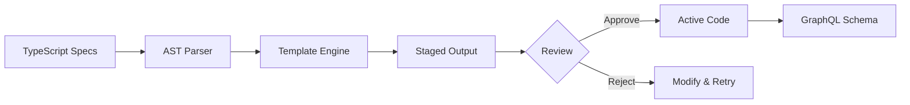

# DiPeO Code Generation Workflow

*Last Updated: 2025-09-08*

## Overview

DiPeO uses a sophisticated code generation system that transforms TypeScript specifications into Python domain models, GraphQL schemas, and Pydantic models. This document explains the complete workflow, directory structure, and best practices.

## Directory Structure

```
dipeo/
├── models/src/                       # TypeScript source specifications
│   ├── node-specs/                   # Node type definitions
│   ├── enums/                        # Enum definitions
│   └── types/                        # Type definitions
├── diagram_generated/                # Active generated code (IN USE)
│   ├── __init__.py                   # Generated models and types
│   ├── enums.py                      # Generated enums
│   └── ...                           # Other generated files
└── diagram_generated_staged/         # Newly generated code (FOR REVIEW)
    └── ...                           # Same structure as diagram_generated/
```

## Complete Workflow

### Step 1: Modify TypeScript Specifications

Edit the TypeScript source files in `/dipeo/models/src/`:

```typescript
// Example: dipeo/models/src/node-specs/my-new-node.ts
export interface MyNewNode extends BaseNode {
  type: 'MY_NEW_NODE';
  config: {
    parameter1: string;
    parameter2: number;
  };
}
```

### Step 2: Build TypeScript Models

```bash
cd dipeo/models
pnpm build
```

This compiles TypeScript and prepares it for parsing.

### Step 3: Generate Python Code

```bash
make codegen
```

This command:
1. Parses TypeScript AST using `parse-typescript` 
2. Generates Python code to `diagram_generated_staged/`
3. Creates Pydantic models with proper type hints
4. Generates GraphQL schema types

### Step 4: Review Changes

```bash
make diff-staged
```

This shows the differences between:
- Current active code (`diagram_generated/`)
- Newly generated code (`diagram_generated_staged/`)

Review carefully for:
- Breaking changes
- Unexpected modifications
- Correct type mappings

### Step 5: Apply Changes

Two options:

#### Option A: Quick Apply (Syntax Check Only)
```bash
make apply-syntax-only
```
- Faster - only checks Python syntax
- Moves `staged/` → `generated/`
- Good for development iterations

#### Option B: Full Apply (Type Checking)
```bash
make apply
```
- Slower - runs full type checking with mypy
- Ensures type safety
- Recommended before commits

### Step 6: Update GraphQL Schema

```bash
make graphql-schema
```

This updates:
- GraphQL type definitions
- Strawberry schema types
- API interfaces

## Staging System Explained

### Why Staging?

The staging directory (`diagram_generated_staged/`) provides:

1. **Safety**: Review changes before applying
2. **Validation**: Syntax/type checking before promotion
3. **Rollback**: Easy reversion if issues found
4. **Comparison**: Side-by-side diff viewing

### Staging Workflow

```
TypeScript Source
    ↓
[make codegen] → diagram_generated_staged/
    ↓
[make diff-staged] → Review Changes
    ↓
[make apply] → diagram_generated/
    ↓
[make graphql-schema] → Update API
```

## Adding New Features

### Adding a New Node Type

1. Create specification:
```typescript
// dipeo/models/src/node-specs/analysis-node.ts
export interface AnalysisNode extends BaseNode {
  type: 'ANALYSIS';
  config: {
    analysisType: 'sentiment' | 'summary' | 'extraction';
    outputFormat: 'json' | 'text';
  };
}
```

2. Build and generate:
```bash
cd dipeo/models && pnpm build
make codegen
make diff-staged  # Review
make apply-syntax-only
make graphql-schema
```

3. Create handler:
```python
# dipeo/application/execution/handlers/analysis.py
@register_handler
class AnalysisNodeHandler(TypedNodeHandler[AnalysisNode]):
    async def execute_request(self, request):
        # Implementation
```

### Adding a New Enum

1. Create enum file:
```typescript
// dipeo/models/src/enums/status.ts
export enum ExecutionStatus {
  PENDING = 'PENDING',
  RUNNING = 'RUNNING',
  COMPLETED = 'COMPLETED',
  FAILED = 'FAILED'
}
```

2. Generate and apply (same workflow as above)

### Adding a New Type

1. Create type definition:
```typescript
// dipeo/models/src/types/metadata.ts
export interface ExecutionMetadata {
  startTime: string;
  endTime?: string;
  duration?: number;
  error?: string;
}
```

2. Generate and apply (same workflow as above)

## Quick Commands

### One-Step Generation (USE WITH CAUTION)
```bash
make codegen-auto
```
This runs all steps automatically:
- parse-typescript
- codegen
- apply-syntax-only
- graphql-schema

⚠️ **Warning**: This skips the review step!

### Individual Commands

```bash
make parse-typescript    # Parse TypeScript to JSON
make codegen             # Generate Python code to staged/
make diff-staged         # Show differences
make apply-syntax-only   # Apply without type checking
make apply              # Apply with type checking
make graphql-schema     # Update GraphQL types
make clean-staged       # Remove staged directory
```

## Common Issues & Solutions

| Issue | Solution |
|-------|----------|
| Import errors after generation | Run `make graphql-schema` |
| Staged changes look wrong | Run `make clean-staged` and regenerate |
| TypeScript build fails | Check syntax in `/dipeo/models/src/` |
| Apply fails type checking | Fix type issues or use `apply-syntax-only` |
| GraphQL schema mismatch | Ensure `make graphql-schema` was run |

## Best Practices

1. **Always Review**: Use `make diff-staged` before applying
2. **Test After Changes**: Run tests after code generation
3. **Commit Staged**: Include both staged and generated in commits
4. **Document Changes**: Update handlers when adding node types
5. **Type Safety**: Use `make apply` (with type checking) before merging

## Code Generation Pipeline



## File Mappings

| TypeScript Source | Generated Python |
|------------------|------------------|
| `/models/src/node-specs/*.ts` | `/diagram_generated/nodes.py` |
| `/models/src/enums/*.ts` | `/diagram_generated/enums.py` |
| `/models/src/types/*.ts` | `/diagram_generated/types.py` |
| All specs | `/diagram_generated/__init__.py` |

## Template System

The code generator uses Jinja2 templates located in:
- `/dipeo/infrastructure/codegen/templates/`

Key templates:
- `pydantic_models.j2` - Pydantic model generation
- `enums.j2` - Enum generation
- `graphql_types.j2` - GraphQL type generation

## Validation Rules

The generator enforces:
1. **Type Safety**: All fields must have type hints
2. **Naming**: Converts TypeScript conventions to Python
3. **Imports**: Automatically resolves dependencies
4. **Defaults**: Handles optional fields correctly

## Advanced Usage

### Custom Generation Filters

Modify `/dipeo/infrastructure/codegen/generators/` to add custom:
- Type mappings
- Validation rules
- Code transformations

### Debugging Generation

```bash
# See what would be generated without writing files
make codegen DIPEO_DRY_RUN=true

# Enable verbose logging
make codegen DIPEO_LOG_LEVEL=DEBUG
```

## Related Documentation

- [Adding New Features Guide](./code-generation-guide.md)
- [DiPeO Architecture](../architecture/overall_architecture.md)
- [CLAUDE.md](../../CLAUDE.md) - Project-wide instructions
